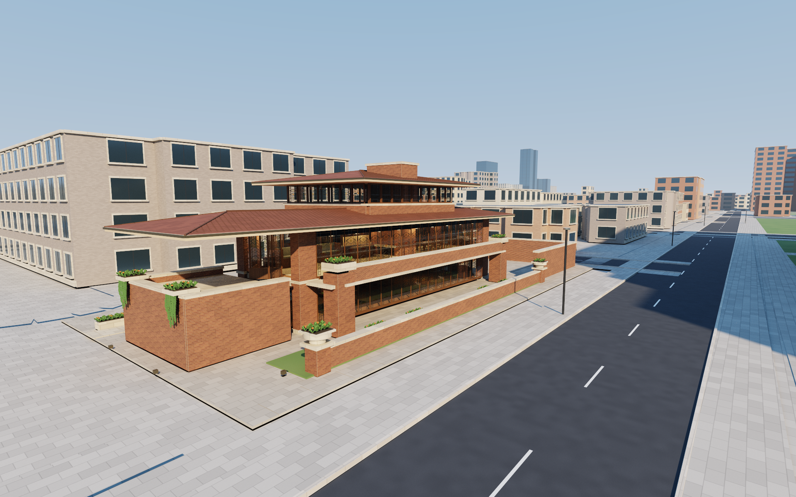
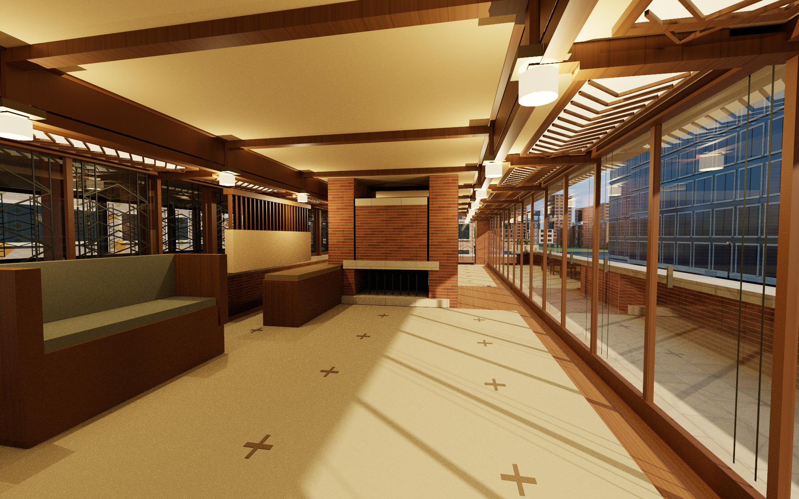
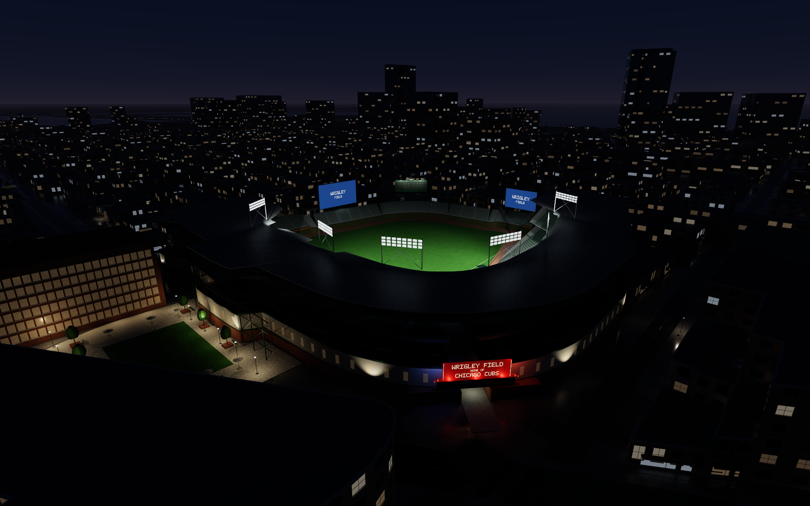
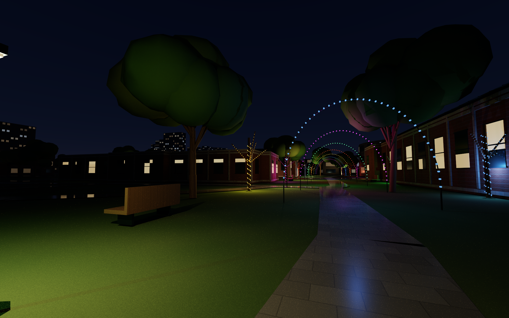

# Atelier

A native Apple Silicon architectural walkthrough engine built with Swift, AppKit, SwiftUI, Metal hardware ray tracing and a fast raster mode. Ten locations share the same renderer, navigation system, animation controls, day/night lighting, and export tools:

- **Navy Pier, Chicago** — seven architectural studies of the Centennial Wheel, Family Pavilion and Polk Bros Park, Chicago Shakespeare Theater, Sable Hotel, the Grand Ballroom and moored boats, plus a three-minute connecting flight from Millennium Park. Mapped approaches, Jane Addams Park, Ohio Street Beach and Olive Park connect it to the same resident city. [Architecture, map sources and routes](docs/NAVY-PIER.md).

- **Chicago Cultural Center** — eight two-minute studies of the limestone exterior, Washington entrance, mosaic stair, Tiffany dome, Preston Bradley Hall and restored Grand Army of the Republic rooms, including a connecting flight from Cloud Gate. [Architecture, references and routes](docs/CULTURAL-CENTER.md).

- **Robie House and Hyde Park, Chicago** — seven architectural studies of Frank Lloyd Wright’s Prairie house and a six-minute connecting flight from McCormick Place through the south lakefront and Hyde Park. The house and the intervening neighborhoods extend the same resident Chicago world.
- **Chicago North Side** — eight studies connecting Millennium Park, Old Town, North Avenue Beach, Lincoln Park Zoo, the conservatory and lily pool, Wrigleyville and Wrigley Field. Two four-minute flights connect Millennium Park to the zoo and the zoo to Wrigley, with mapped neighborhoods, beaches and harbors in the same resident world.
- **Museum Campus, Chicago** — eight studies of the Field Museum, Shedd Aquarium, Adler Planetarium and its original animated dome show, Soldier Field, Burnham Harbor boats and all four McCormick Place buildings. A continuous three-minute flight connects the Art Institute to the Field Museum; selected public interiors are walkable.
- **Chicago Lakefront** — eight views along the Magnificent Mile, the historic Water Tower and pumping station, Water Tower Place, the former John Hancock Center, Wrigley and Tribune towers, Buckingham Fountain, Grant Park, moored harbor boats and light traffic on Lake Shore Drive.
- **Millennium Park, Chicago** — eight views, reflective Cloud Gate with a walkable underside, Pritzker Pavilion, Crown Fountain, gardens, the detailed Art Institute and a continuous four-minute flight from Willis Tower through the park into the museum.
- **Chicago Skyline** — eight two-minute studies with authored daylight, warm daylight, sunset and night presentations. An eastward Oak Park telephoto panorama, a golden-hour North Branch flight about 18–22 metres above the river toward Wolf Point, and a Ping Tom Memorial Park river view complement the Adler, North Avenue and offshore compositions. It follows Willis Tower in the Chicago demo and uses the same resident geometry. The western foreground is generalized land; the intervening western neighborhoods have not been built out. [Skyline references and lighting](docs/SKYLINE.md) · [Western and river viewpoint research](docs/SKYLINE-REFERENCE-UPDATE.md).
- **Willis Tower, Chicago** — eight views, the nine bundled tubes and their mapped setbacks, individually modeled curtain-wall panels and connections, Catalog entrance and roof garden, Skydeck at its published elevation, five transparent Ledge boxes, broadcast antennas, and mapped Loop surroundings.
- **Eiffel Tower, Paris** — nine views, detailed ironwork and rivets, observation terraces and visitor spaces, mapped gardens and nearby buildings, the Seine, Pont d’Iéna, and a river cruiser.

Nearby layouts use bundled OpenStreetMap snapshots. Architectural photographs, published dimensions, and aerial/satellite references inform the models. These are detailed architectural reconstructions, not surveyed digital twins: interiors, façade treatments, vegetation, boats, and lighting contain authored interpretations. [Robie House architecture](docs/ROBIE-HOUSE.md) · [Hyde Park and the south lakefront](docs/HYDE-PARK.md) · [North Side and maps](docs/NORTH-SIDE.md) · [Old Town and beach-house references](docs/NORTH-SIDE-LANDMARKS.md) · [Lincoln Park Zoo](docs/LINCOLN-PARK-ZOO.md) · [Wrigley Field](docs/WRIGLEY-FIELD.md) · [Museum Campus and maps](docs/MUSEUM-CAMPUS.md) · [Field and Shedd interiors](docs/MUSEUM-BUILDINGS.md) · [Adler and the dome show](docs/ADLER.md) · [McCormick Place](docs/MCCORMICK-PLACE.md) · [Lakefront and map methodology](docs/LAKEFRONT.md) · [Magnificent Mile landmarks](docs/MAGNIFICENT-MILE.md) · [Wrigley and Tribune](docs/MAGNIFICENT-GATEWAY.md) · [Park methodology](docs/MILLENNIUM.md) · [Art Institute](docs/ART-INSTITUTE.md) · [Willis methodology](docs/WILLIS.md) · [Chicago map data and references](docs/CHICAGO.md) · [Paris methodology](docs/PARIS.md).









## Run

Double-click **Launch Atelier.command**, or run:

```sh
./scripts/build-app.sh
open dist/Atelier.app
```

The build now **precaches Chicago before the app is opened**, and the launcher rebuilds and precaches when source or assets have changed. Run `./Launch\ Atelier.command build` to prepare the next launch without opening a window. Use `./scripts/build-app.sh --precache-city all` to prepare Paris too, or `--no-precache` for a development build without this step. [Startup cache, build commands and native timing method](docs/STARTUP.md).

The packaged app contains both cities and works without network access or the source directory. Version 2.7.0 loads scene and navigation caches in parallel, including a compact landmark focus catalog. It displays the full city geometry in Fast Raster before preparing unchanged-quality ray tracing in the background, then automatically adopts the selected renderer. Willis Tower remains the opening destination. Use the location menu or **L** to cycle between Eiffel Tower, Willis Tower, Chicago Skyline, Millennium Park, Chicago Cultural Center, Chicago Lakefront, Navy Pier, Museum Campus, Chicago North Side and Robie House. All nine Chicago destinations reuse one resident world and its GPU/navigation resources; switching to Paris loads its independent scene. During Chicago Demo, **L** cycles only the Chicago destinations and continues playback there.

The loading panel shows measured preparation steps and elapsed time, with 100 bundled Chicago facts rotating every three seconds. Completion reaches 100% after an actual city-frame presentation. The statistics panel’s **stopwatch / City** button opens step timings and separate ray-tracing readiness; its detailed JSON report is saved to `~/Library/Logs/Atelier/last-startup.json`. [Loading behavior and measurement scope](docs/STARTUP.md) · [Chicago facts and sources](docs/CHICAGO-FACTS.md).

The public source repository is [wacastel/atelier-architecture](https://github.com/wacastel/atelier-architecture).

Requires macOS 14 or later, the Xcode Command Line Tools with Swift 5.10 or newer to build, and a Metal ray-tracing capable GPU. Hardware validation is performed on this Mac Studio's M3 Ultra with 512 GB unified memory. The build creates an ad-hoc signed, native arm64 app; it is not notarized for distribution to other computers.

## Explore

The opening idle cycle visits each view in order during daytime, switches to night after the last view, visits the sequence again, then returns to day. At 1×, each view lasts 20 seconds. The idle speed controls both the gentle camera motion and the dwell time, independently of walkthrough pace. Outside Chicago Demo, selecting a view holds it with gentle motion; **Play** starts that view's own walkthrough. Routes last 56–360 seconds. Robie House has seven two-minute studies and a six-minute connecting flight. The **Chicago connecting flights** menu offers **Willis → Park → Art Institute** (four minutes), **Art Institute → Field Museum** (three minutes), **Millennium Park → Lincoln Park Zoo** (four minutes), **Lincoln Park Zoo → Wrigley Field** (four minutes), **McCormick Place → Robie House** (six minutes), **Millennium Park → Navy Pier** (three minutes), and **Millennium Park → Cultural Center** (two minutes), preserving the chosen day/night lighting.

**Chicago Demo / C** starts at a random view in a random Chicago location, then plays sequentially through Willis Tower → Chicago Skyline → Millennium Park → Chicago Cultural Center → Chicago Lakefront → Navy Pier → Museum Campus → Chicago North Side → Robie House. Each destination has eight routes; one complete **72-route pass lasts 135 minutes 36 seconds at 1×**. Starting preserves both pace preferences. Skyline views use their authored lighting during automatic presentation. Explicitly selecting or reselecting a Skyline view restores its authored lighting and sunset-lights default; manual lighting changes otherwise hold until the next selection or complete idle/demo cycle. Automatic day/night pass alternation is preserved. The demo changes day/night when it wraps from Robie House’s final route to Willis Tower’s first route. A random opening partway through the sequence reaches that boundary before its first complete pass.

Selecting any Chicago location or view keeps the demo active and begins that route at normal forward playback. **↑ / ↓**, or the demo’s previous/next buttons, cross location boundaries: the last view advances to the first view in the next location, and the first view goes back to the final view in the previous location. A full-city wrap in either direction changes day/night. **Space** pauses and resumes; **Stop Chicago Demo / C** exits while holding the current pose. Selecting Paris, starting idle cycling, focusing an object, or taking manual camera control leaves the demo. [Demo instructions](docs/DEMO.md).

Click visible landmark or building geometry to focus it; a tint and outline mark the selected surfaces. Drag to orbit and pinch, use a mouse wheel or scroll with two fingers to move closer or farther away. Focusing from a distant view preserves the camera’s entry distance, including the Oak Park panorama. Without a focus, pinching changes the lens field of view while leaving the camera position fixed. Clicking the same object keeps it selected. Clicking elsewhere releases it without changing the pose or immediately selecting a replacement; a subsequent click can select another object. **Escape** or the focus clear button also releases it. Selecting a focus or pinching takes manual control of the camera. [Focus controls and picking limits](docs/FOCUS.md).

**T** points the normal camera straight down, above the selected object's centre when focused or at the current horizontal position otherwise. It retains the lens and normal Fly controls, raising the camera only as needed for roof clearance. Focused pinch and scroll keep this vertical view; an orbit drag changes its angle. **WASD** travels parallel to the ground even when looking up or down; **Q / E** changes altitude.

**B / Map mode** switches the main Chicago viewport to a fixed, north-up perspective overhead view. **WASD** pans north, west, south and east; its speed scales with the visible ground span and **Shift** triples it. Dragging also pans; pinch, scroll or use **− / +** to zoom. **B** or **Escape** returns to a 3D overlook above the current map centre. This is separate from the compact navigation map shown with **M**; all three inset sizes stay below one quarter of the viewport. **G**, or **⌃⌘F**, toggles native full screen in either view. [Map modes and controls](docs/MAP-MODE.md).

| Control | Action |
| --- | --- |
| Location menu / **L** | Choose a destination; during demo, L cycles only Chicago and keeps playback active |
| View card / **1–8** (Chicago), **1–9** (Paris) | Select and hold a view; during demo, begin its walkthrough and continue sequencing |
| **↑ / ↓** | Previous / next view; during demo, cross location boundaries and continue playback |
| **Idle Play / Idle Pause**, or **I** | Resume the view cycle / hold the current view |
| **[ / ]** | Decrease / increase idle speed: 0.25×, 0.5×, 1×, 2×, 4× |
| **Play / Space** | Start, pause, or resume the selected walkthrough |
| **Chicago Demo / C** | Start the 72-route Chicago sequence at a random location/view / stop and hold the current pose |
| **← / →** | Rewind / fast forward; distinct presses cycle 2×, 4×, 8× |
| **Pace / timeline** | Set walkthrough pace independently / seek |
| **N / Moon button** | Toggle day/night without restarting or resuming the animation |
| **Lighting settings** | Choose warm daylight, neutral daylight, sunset or night; Skyline also has authored view presets |
| **G / full-screen button / ⌃⌘F** | Enter / leave native macOS full-screen mode, including fixed Map mode |
| Window titlebar / edges | Move / resize; hold camera and scene clocks during the gesture, then resume without a time jump |
| Click visible geometry | Select when unfocused; keep the same object selected; click elsewhere to clear; also available in Map mode |
| Left mouse drag | Pan the city under the pointer; orbit when focused; always pan in Map mode |
| Shift + left mouse drag / right mouse drag | Look around or orbit a focus; in Map mode Shift-left still pans and right drag is ignored |
| **M / inset map button** | Show/hide the compact navigation map; S/M/L progressively add room and labels |
| **B / Map mode button / Navigation → Map** | Enter the north-up overhead Chicago view; B or Escape exits to a 3D overlook at the current centre |
| **T** | Point the normal camera straight down with roof clearance; preserve focus and normal Fly controls |
| **F / speed menu / − / +** | In normal 3D exploration, toggle Walk/Fly or step flight speed from 8 to 800 m/s; −/+ zoom in Map mode |
| **Renderer menu** | Select Path Tracing, Direct Ray Tracing or Fast Raster at the same camera position |
| **R** | Cycle Path Tracing → Direct Ray Tracing → Fast Raster |
| **WASD / Q / E / Shift** | Move parallel to ground / fly up / fly down / 3× speed boost; Map WASD pans cardinally and retains selection; Q/E are inactive in Map |
| Pinch | Optical zoom in normal exploration; move toward/away from a focused object; change ground coverage in Map mode |
| Mouse wheel / two-finger scroll | Zoom a focused object or Map mode; otherwise step the fixed flight-speed presets |
| **H / ? / Esc** | Hide interface / show controls / clear focus, release keys and close help |
| **⌘R / ⌘⇧S** | Return to the location’s opening view / save a render to Pictures/Atelier |

The inset navigation map uses offline data and shows camera position and heading with a 24-point dotted marker. A camera beyond coverage has an explicit off-map direction and distance. All three sizes remain compact; larger sizes reveal more of the 34 named landmarks, including the Cultural Center, with labels arranged to avoid overlap. Hovering a landmark’s dot or text highlights both. Clicking either frames and focuses that landmark around its fixed architectural centre, while clicking bare map ground chooses a roof-cleared overlook and clears focus. In Map mode, landmark selection recentres the overhead view and retains selection without tilting the camera. The Places menu reaches every named landmark even when its label is hidden.

Dragging the inset translates it and the real camera together; releasing a drag does not trigger a click. Landmark selection preserves lighting and associates the nearest architectural study with the Play button. It takes manual control, ending automatic playback. The main Map mode keeps the camera vertical and north-up: **WASD** pans without changing the height, lens or selection. Altitude keys, look/orbit, view-selection, **T** and playback controls are inactive until it is exited. **G, R, N, M, H** and help remain available. Selection can be shown in Map mode while dragging still pans and pinch still changes ground coverage. [Current map behavior and limits](docs/MAP-MODE.md).

In normal Fly mode, flight starts at 400 m/s. The speed menu, minus/plus keys and unfocused scrolling step through 8, 30, 80, 180, 400 and 800 m/s; Shift temporarily triples the chosen speed. Movement uses elapsed time, so a low rendering frame rate no longer reduces travel speed proportionally. Left dragging pans across the ground plane; Shift-left dragging or right dragging changes the viewing direction. Q flies up and E flies down. Focused-object orbit and zoom remain available.

Manual movement takes control of the camera; local traffic continues. Pausing a walkthrough freezes both its camera and traffic clock. Walk mode uses floor support and collision checks; Fly mode allows unrestricted inspection. Individual routes are authored architectural studies. Millennium Park’s eighth route connects Willis Tower, the park and an interpreted Modern Wing gallery without a scene cut or teleport. Full-screen and ordinary window sizes retain the same rendering and input controls. The view cards scroll horizontally when needed.

Seeking and the arrow-key shuttles stay within the current route, including during the Chicago demo. A shuttle pauses at the route's beginning or end; **Space** resumes forward at a rewound beginning, or continues to the next demo route from a forward endpoint. Lighting and pace changes keep the demo active. Skyline's manual lighting override holds for the current pass; the next complete idle/demo cycle resumes the alternating authored/night passes. Lighting changes, window moves, resizing and full screen retain an object focus; moving or resizing the window freezes both camera animation and the shared traffic/show clock until the gesture ends.

Robie House’s eighth view connects McCormick Place to the house through 31st Street Harbor, the Oakwood lakefront, Promontory Point and Hyde Park. The full six-minute flight stays in the shared Chicago world and finishes at the house’s opening bookmark.

## Music

Ten original ambient pieces form one shared playlist, with a distinct opening piece assigned to each location. The Cultural Center adds **Light Beneath the Dome**, a D-flat-major composition at 57 BPM; the previous eight audio files are unchanged. Soft piano, pads and plucks accompany the views. Music starts enabled at volume 0.16 on first use; enable and volume preferences persist. A location change selects its opening piece with a three-second crossfade, and tracks advance through the shared playlist before wrapping. Turning music off fades and pauses it; turning it on resumes. Volume zero mutes while playback continues. The native player does not add an audio track to CLI movie exports. [Existing composition and playback system](docs/AMBIENT-MUSIC.md) · [Cultural Center track](docs/CULTURAL-CENTER.md#original-ambient-music).

## Rendering

Version **2.4.1** puts all three renderer choices directly in the toolbar menu, with a checkmark beside the active mode. There is no hover submenu. Frame statistics and playback updates no longer rebuild this menu while it is open.

The toolbar and Render settings offer **Path Tracing**, **Direct Ray Tracing** and **Fast Raster**. Switching preserves the camera, lighting, focus and playback. **R** cycles Path Tracing → Direct Ray Tracing → Fast Raster. Path Tracing remains the default and progressively estimates reflections, shadows and indirect lighting. Direct Ray Tracing uses deterministic rays for hard shadows and reflections with an ambient-light approximation and spatial edge antialiasing; it does not reproduce the path tracer's multi-bounce indirect lighting. The final renderer passes 48 functional GPU checks, 27 presentation checks and a ten-case shared-city comparison. [Illustrated comparison](docs/validation/v2.4/render-mode-comparison.html) · [implementation, measured timings and limits](docs/DIRECT-RAY-TRACING.md).

In Render settings, **Building lights at sunset** switches building windows and fixed architectural/site fixtures on or off while retaining the sunset sky and sunlight. It defaults to **off** and only applies to Sunset; day and night keep their existing lighting. Vehicle lights, boat cabins and the planetarium show remain active. For exports, `--sunset-lights-on` enables the lights; `--sunset-lights-off` explicitly retains the default. Selecting the Skyline’s opening sunset view restores its unlit-building default, while the night view keeps its authored lights.

Raster draws the same city and moving traffic using a depth buffer, frustum culling, direct lighting, procedural materials, glass and approximate environment reflections. It submits no ray-tracing or surface-guide dispatches and no traffic acceleration-structure updates per frame. Four-sample anti-aliasing smooths fine geometry edges on this Mac (with a lower-sample fallback on other devices). It omits traced shadows, local reflections, refraction and indirect lighting; subpixel detail can still alias. At startup, the first city frame uses this raster path while acceleration structures build in the background. The selected ray-traced renderer takes over when ready; later switches can reuse those structures. This retains the resident scene and eventual ray-tracing memory cost.

A **legacy version 2.0** matched 1280 × 850 offscreen test on this M3 Ultra measured median GPU frame times of **13–14 ms in raster versus 76–90 ms in ray tracing for the Robie exterior**, and **about 14 ms versus 295–297 ms in the living room**, using four ray samples and three bounces. These are bounded historical GPU measurements, not a version 2.1.1 measurement or native app FPS guarantee. [Exact validation and limitations](docs/VALIDATION.md#version-20-navigation-and-render-modes).

The Oak Park study uses a clearer atmosphere for its roughly 13.6 km sightline, with a consistent blue daylight horizon and reduced haze in both rendering modes. Other views retain their established atmosphere. Its cropped 9° opening field of view emphasizes the distant skyline; nearby western ground remains generalized, undetailed land. [Camera choices and atmosphere](docs/SKYLINE.md#the-longer-western-view).

Path Tracing traces the actual modeled triangles using Metal acceleration structures, GGX reflections, direct-light shadow rays, and multibounce lighting. Cloud Gate’s polished shell and concave underside reflect the shared Chicago scene, including reflected reflections; they do not use a painted skyline. Water uses filtered analytic ripple normals and dielectric Fresnel reflections. Selected Chicago glazing uses thin-sheet transmission and reflection; the first camera pane traces both branches to reduce movement noise. [Glass implementation and limits](docs/GLASS.md).

Fast Owen-scrambled Sobol samples distribute camera, sun, and material samples across each pixel’s sampling domain. Pure metals sample their reflective GGX lobe directly, and a numerically stable GGX evaluation retains the narrow highlights of polished steel. `--random-sampling` restores independent random samples for controlled comparisons.

Selective path regularization broadens difficult secondary glossy reflections after an ordinary surface scatter, reducing bright motion speckles while preserving directly viewed materials and first reflections through perfect glass. A chain of very smooth metal reflections, such as Cloud Gate’s underside, retains its authored lobes until an ordinary scatter occurs. Those metal reflections still use finite GGX lobes. Regularization introduces a documented lighting bias; `--no-regularization` disables it for comparisons. [Method and GPU checks](docs/MOTION.md#selective-glossy-path-regularization).

A conservative spatial light grid restricts local-light evaluation to candidates whose declared finite range can reach the current cell. Candidate lists retain scene order, and the renderer falls back to the complete linear list if a grid cannot be built within its bounds. `--linear-lights` selects that baseline explicitly. Museum interior fixtures can remain on during daytime while the sun and sky retain daytime lighting; architectural exterior fixtures switch on at night.

Moving cars and buses occupy a small, separate Metal acceleration structure. Only the traffic geometry and its top-level instance structure are updated; the city remains resident. Absolute scene time reproduces the same vehicle positions during scrubbing and export. Moving headlights illuminate and shadow the actual roadway. Local reactive guides reject stale vehicle, reflection and nearby lighting history while preserving valid history on unrelated surfaces.

Motion reconstruction uses deterministic world position, depth, normal, material and albedo guides, rejects stale history, and filters within compatible surfaces. Spatial passes retain temporal sample confidence to avoid repeatedly softening accumulated roof seams and shadow detail. Distant night coverage, emissive windows, and mixed reflection/transmission require conservative history handling. Fine sampling grain can remain in reflective water, thin detail, and moving glass. Paused views progressively accumulate samples. [Motion reconstruction](docs/MOTION.md).

| Quality | Maximum render width | Path interactions | New samples/frame |
| --- | ---: | ---: | ---: |
| Interactive | 960 px | 2 | 4 |
| Balanced | 1440 px | 3 | 4 |
| Ultra | 2560 px | 5 | 8 |

Render dimensions preserve the actual drawable's aspect ratio, including portrait windows and full-screen displays; both axes are bounded by the renderer's 8192-pixel limit. GPU memory usage is scene- and viewport-dependent. Unified memory and native ray-tracing acceleration are used directly; allocating all 512 GB is unnecessary for these models.

## Building more city sections

The reusable [city-building guide (Markdown)](docs/CITY-BUILDING-GUIDE.md), [offline HTML edition](docs/city-building-guide.html) and [PDF edition](docs/City-Building-Guide.pdf) document research, map preparation, architectural modeling, shared-world integration, eight-view routes, lighting, performance checks, release packaging and a starter brief for a fresh context window.

The **Chicago Cultural Center** now develops the earlier landmark proposal into an authored destination, using the existing mapped block beside Millennium Park. Its [architecture and route notes](docs/CULTURAL-CENTER.md) distinguish reference evidence from interpreted details; the [original recommendation](docs/NEXT-CHICAGO-LANDMARK.md) remains a historical research record.

## Render and record

The command-line interface uses the same scenes and shaders as the application. `--location` defaults to `paris` for compatibility with earlier export commands; choose `chicago` for Willis Tower, `skyline` for the lakefront, river and western panoramas, `millennium` for the park and museum, `culturalcenter` for the Cultural Center, `lakefront` for the Magnificent Mile, Grant Park and harbors, `navypier` for Navy Pier and its waterfront approach, `campus` for Museum Campus and McCormick Place, `northside` for Old Town, Lincoln Park and Wrigley Field, or `robie` for Robie House and its south lakefront connection. View numbers are zero-based on the command line.

Add `--raster` to render, gallery, video or self-test commands for the fast renderer. Ray sample counts are ignored in raster mode; the temporal ray-tracing benchmark intentionally requires ray tracing.

```sh
# Cultural Center's two-minute arrival from Cloud Gate.
./dist/Atelier.app/Contents/MacOS/ArchitectureEngine --location culturalcenter \
  --video output/Millennium-Park-to-Cultural-Center.mp4 --single-view --stop 7 \
  --seconds 120 --fps 24 --width 1920 --height 1080 --samples 16

# The eight Cultural Center bookmarks at night.
./dist/Atelier.app/Contents/MacOS/ArchitectureEngine --location culturalcenter \
  --gallery output/cultural-center-night --lighting 2 --samples 128

# Complete six-minute flight from McCormick Place to Robie House.
./dist/Atelier.app/Contents/MacOS/ArchitectureEngine --location robie \
  --video output/McCormick-Place-to-Robie-House.mp4 --single-view --stop 7 \
  --seconds 360 --fps 24 --width 1920 --height 1080 --samples 16

# Seven house studies and the connecting route, with nighttime lighting.
./dist/Atelier.app/Contents/MacOS/ArchitectureEngine --location robie \
  --gallery output/robie-night --lighting 2 --samples 256

# The full four-minute route from the zoo through northern harbors to Wrigley.
./dist/Atelier.app/Contents/MacOS/ArchitectureEngine --location northside \
  --video output/Zoo-to-Wrigley.mp4 --single-view --stop 6 \
  --seconds 240 --fps 24 --width 1920 --height 1080 --samples 16

# All eight North Side scenes with reference-informed night lighting.
./dist/Atelier.app/Contents/MacOS/ArchitectureEngine --location northside \
  --gallery output/northside-night --lighting 2 --samples 256

# Full southbound connecting flight, including arrival inside Stanley Field Hall.
./dist/Atelier.app/Contents/MacOS/ArchitectureEngine --location campus \
  --video output/Art-Institute-to-Field-Museum.mp4 --single-view --stop 0 \
  --seconds 180 --fps 24 --width 1920 --height 1080 --samples 16

# Original planetarium show, with the same clock as camera, pause and rewind.
./dist/Atelier.app/Contents/MacOS/ArchitectureEngine --location campus \
  --video output/Adler-Dome-Show.mp4 --single-view --stop 4 \
  --seconds 180 --fps 24 --width 1920 --height 1080 --samples 16

# All eight new lakefront views and their Michigan Avenue landmarks.
./dist/Atelier.app/Contents/MacOS/ArchitectureEngine --location lakefront \
  --gallery output/lakefront-day --width 1920 --height 1200 --samples 128

# The full two-minute Lake Shore Drive flight, with deterministic moving traffic.
./dist/Atelier.app/Contents/MacOS/ArchitectureEngine --location lakefront \
  --video output/Lake-Shore-Drive-Night.mp4 --single-view --stop 7 \
  --lighting 2 --seconds 120 --fps 24 --width 1920 --height 1080 --samples 16

# Complete continuous flight at ordinary 1× speed, from tower to museum.
./dist/Atelier.app/Contents/MacOS/ArchitectureEngine --location millennium \
  --video output/Chicago-Park-Museum-Flyby.mp4 --single-view --stop 7 \
  --seconds 240 --fps 24 --width 1920 --height 1080 --samples 16

# All eight park/museum bookmarks, with actual traced nighttime reflections.
./dist/Atelier.app/Contents/MacOS/ArchitectureEngine --location millennium \
  --gallery output/millennium-night --lighting 2 --samples 256

# Geometry, GPU dispatch, accumulation, viewport resizing, and importer checks.
./dist/Atelier.app/Contents/MacOS/ArchitectureEngine --location chicago --self-test

# All eight Chicago viewpoints, including a night gallery.
./dist/Atelier.app/Contents/MacOS/ArchitectureEngine --location chicago \
  --gallery output/chicago-day --width 1920 --height 1200 --samples 128
./dist/Atelier.app/Contents/MacOS/ArchitectureEngine --location chicago \
  --gallery output/chicago-night --lighting 2 --width 1920 --height 1200 --samples 256

# Eight full routes compressed into twelve-second chapters (96 seconds total).
./dist/Atelier.app/Contents/MacOS/ArchitectureEngine --location chicago \
  --video output/Willis-Walkthrough.mp4 --seconds 96 --fps 24 \
  --width 1920 --height 1080 --samples 12

# A complete 56-second night route at its normal playback speed.
./dist/Atelier.app/Contents/MacOS/ArchitectureEngine --location chicago \
  --video output/Willis-Night-Route.mp4 --single-view --stop 7 --lighting 2 \
  --seconds 56 --fps 24 --width 1920 --height 1080 --samples 16

# Inspect a route at a specific time, or export gentle idle motion with --idle.
./dist/Atelier.app/Contents/MacOS/ArchitectureEngine --location chicago \
  --render output/Willis-Ledge.png --stop 5 --at 28 --samples 256

# Keep the complete Paris scene and its nine-view, 108-second export.
./dist/Atelier.app/Contents/MacOS/ArchitectureEngine --location paris \
  --video output/Paris-Walkthrough.mp4 --seconds 108 --fps 24 --samples 12
```

`--camera x,y,z --target x,y,z --fov 60` overrides a still camera. `--raw` disables reconstruction in moving previews and video comparisons; still exports already use unfiltered progressive radiance followed by exposure and tone mapping. `--obj building.obj --scale 1 --render image.png` imports another building for still rendering; imported materials have the limits described in [engine documentation](docs/ENGINE.md). Run `--help` for all options. Video exports require a new filename and never overwrite an existing recording.

Check an existing movie’s complete decoding, frame count and uniform presentation timestamps with:

```sh
python3 scripts/validate-video-timing.py output/Chicago-Park-Museum-Flyby.mp4 \
  --seconds 240 --fps 24 --report output/flyby-timing.json
```

Generated videos, high-resolution renders, build products and local reports stay in `output/` or `dist/` and are excluded from Git. [Demo notes](docs/DEMO.md) · [validation](docs/VALIDATION.md).

## Verify and reproduce

### Version 2.7.0

Startup now restores navigation alongside scene geometry, caches the landmark focus catalog, and presents a full-geometry raster preview before building ray-tracing resources in the background. Across three fresh warm-cache native launches, the first visible city improved from **10.629 to 3.175 seconds median** (about **70% less waiting**). The first image now uses Fast Raster; ray-tracing resources were ready separately at **4.984 seconds median**, after which the selected renderer takes over. [Current measurement method, scope and comparison](docs/STARTUP.md#validation).

The loading facts are bundled offline with [100 fact-specific source citations](docs/CHICAGO-FACTS.md). Loading progress tracks completed preparation steps, and actual Metal presentation controls completion. The stopwatch and launch JSON keep the first visible city time separate from ray-tracing readiness. The North Branch Skyline route now uses a low golden-hour composition, and explicit Skyline view selection restores authored lighting defaults. Earlier release evidence below remains historical.

### Historical version 2.5.0

Navy Pier adds eight routes to the shared city. The release passes [121,182 playback checks](docs/validation/v2.5/playback-final.txt), [17 geometry checks](docs/validation/v2.5/navy-pier-geometry.json), [map-source validation](docs/validation/v2.5/navy-pier-map.json), and [851 actual-controller checks](docs/validation/v2.5/controller-integration.json). The sunset switch passes [63 GPU checks across Path, Direct and Raster](docs/validation/v2.5/sunset-lights.json), including emissive surfaces, reflected light and unchanged daytime/nighttime behavior. [Daylight](docs/validation/v2.5/day-contact.jpg) and [night](docs/validation/v2.5/night-contact.jpg) contact sheets cover all eight bookmarks. [Release scope and references](docs/NAVY-PIER.md).

### Historical version 2.4.0

The controls pass [6,824 navigation checks](docs/validation/v2.4/manual-city-navigation.json), [755 actual-controller checks](docs/validation/v2.4/map-mode-integration.json) and [449 pointer/key checks](docs/validation/v2.4/viewport-input.json). They cover cardinal Map panning, span-scaled speed and Shift boost, retained focus and framing, held-key resets and the three-mode renderer selector. The controller fixture steps real movement methods without constructing a Metal device or attaching a native window.

The final Direct Ray renderer passes [48 GPU checks](docs/validation/v2.4/direct-ray.json), including real offscreen reflections, glass, shadows, focus depth, moving headlights and deterministic output. Its spatial antialiasing passes [27 presentation checks](docs/validation/v2.4/direct-presentation.json), including unchanged original Path/Raster presentation. The [matched shared-city comparison](docs/validation/v2.4/render-modes.json) passes ten cases and 420 rendered frames, including warmup. At 1280 × 850, median GPU time ranged from **9.0–18.2 ms for Direct** and **40.0–296.1 ms for Path**, using four path samples and three bounces. These are different lighting algorithms and bounded offscreen GPU measurements, not native FPS. [View the comparison images](docs/validation/v2.4/render-mode-comparison.html).

The [2.4.0 build 17 package](docs/validation/v2.4/package.json) is signed native arm64 with its four bundled shaders matching source. [Native app checks](docs/validation/v2.4/native.json) verified G entering/exiting full screen in normal and Map views, the renderer menu, R restoring Direct mode during playback, day/night walkthrough rendering and visible landmark focus. Sustained WASD/Shift input is covered by the actual-controller fixture; the native automation sends immediate taps, so it does not certify physical held-key timing. Path Tracing remains the default and can retain visible grain in difficult interiors; the [traffic-guide correction and rejected filter investigation](docs/validation/v2.4/path-noise/review.json) do not establish an interior-noise cure. Prior release results below remain historical.

### Historical version 2.3.0

The Cultural Center destination and all existing routes pass [106,617 CPU playback checks](docs/validation/v2.3/playback.txt), covering all 73 routes including Paris. The standalone Cultural Center passes [2,912 geometry and navigation checks](docs/validation/v2.3/cultural-center-geometry.json); the shared Chicago scene contains **45,953,309 static triangles**. The revised controls pass **25,015 map**, **6,765 manual navigation**, **1,662 focus**, **662 actual-controller** and **449 pointer/key** checks. The bounded raster/RT selection fixture passes **39,496 checks**; music controller and full-file audio checks pass **299** and **165** respectively. [Current evidence and scope](docs/validation/v2.3/README.md).

The [full-city renderer check passes 37 assertions and 18 reviewed stills](docs/validation/v2.3/cultural-rendering.json): all eight Cultural Center bookmarks in day/night and selection in both rendering modes. The [2.3.0 build 16 package](docs/validation/v2.3/package.json) is signed native arm64, with all 27 bundled resources matching source. The [scoped native review](docs/validation/v2.3/native-review.json) confirms Cultural Center map-label selection, visible focus in both renderers, same-object retention, clearing elsewhere, normal-camera **T**, fixed **B** Map mode and focused button zoom, plus the new music title at 16% volume. Physical pinch and held W/S travel were not established by the native automation. These still and control checks do not establish native FPS or continuous-motion noise quality. Earlier release results remain historical. [Cultural Center scope](docs/CULTURAL-CENTER.md#validation-status).

### Historical version 2.2.0

Version **2.2.0 (build 15)** passed [24,864 map checks](docs/validation/v2.2/navigation-map.json), [6,260 manual-navigation and pinch-math checks](docs/validation/v2.2/manual-navigation.json), [544 actual-controller checks](docs/validation/v2.2/map-mode-integration.json), [449 pointer/key checks](docs/validation/v2.2/viewport-input.json) and [1,605 focus regression checks](docs/validation/v2.2/focus-navigation.txt). The [native arm64 package passed strict signature verification with all 26 resources matching source](docs/validation/v2.2/package.json).

The [scoped native review passed](docs/validation/v2.2/native-review.json), including a fresh final-build check of landmark text/dot clicks, overhead pan and button zoom, blocked playback/view keys and disabled Map-mode Reset. Earlier captures with the same navigation code cover exit at the current map centre, day/night ray tracing, raster, resizing and full screen. Physical trackpad pinch and hover-only event delivery remain unverified; no dedicated GPU harness or FPS benchmark was run. [Detailed scope and limitations](docs/MAP-MODE.md#validation). Prior release results below remain historical.

### Historical version 2.1.1

Version **2.1.1 (build 14)** passed [131 renderer checks with 24 stills and visual review](docs/SKYLINE.md#version-211), [92,867 playback checks across all 65 routes](docs/validation/v2.1.1/skyline/playback.txt), [21,434 map checks](docs/validation/v2.1.1/navigation-map.json), [1,605 focus checks](docs/validation/v2.1.1/focus-navigation.json), and the [39,485-check raster regression](docs/validation/v2.1.1/raster-regression.json). The focus suite includes 21 assertions exposing the old behavior. The [arm64 package passed strict signature verification and all 26 source/resource comparisons](docs/validation/v2.1.1/package.json). Its isolated Oak Park self-tests [passed in both ray-tracing and raster modes](docs/validation/v2.1.1/package-rendering/runs.json).

[Native interaction checks for that release were blocked by the locked Mac](docs/validation/v2.1.1/native-review.json). Those CPU and offscreen results do not establish native off-map/focus behavior, continuous-motion quality or native FPS. [Complete release evidence](docs/validation/v2.1.1/README.md). That version's shared city contained 45,496,818 static triangles and 56 Chicago routes, 65 including Paris, with 102 minutes 36 seconds for a Chicago pass at 1×.

### Historical version 2.1.0

Version **2.1.0 (build 13)** completed scoped [native interaction checks](docs/validation/v2.1/native-review.json), [signature and bundled-resource verification](docs/validation/v2.1/package.json), and [Skyline CPU/GPU review](docs/SKYLINE.md#historical-version-210). Native checks observed the Willis/400 m/s default, all map sizes and live camera dragging, resize/full-screen behavior, R while T stayed inactive, fixed speed selection, music controls and natural track advancement, authored Skyline lighting and a demo location boundary. The [packaged Skyline sunset self-tests](docs/validation/v2.1/package-rendering/runs.json) also passed in ray-tracing and raster modes from an isolated working directory.

Sustained Q/E movement and Shift-held dragging have CPU and event-wiring coverage; the native automation could not reliably hold those inputs. Audio decoding and transport were checked, but subjective listening quality was not assessed. Older performance measurements remain labeled by release; the commands below describe reproducible checks rather than claiming every historical test was rerun.

```sh
# CPU: map geometry, landmark mesh, light-grid coverage, and camera controls.
python3 scripts/validate-paris-context.py
python3 scripts/validate-chicago-context.py
python3 scripts/validate-millennium-context.py
./scripts/validate-millennium-geometry.sh
./scripts/validate-magnificent-mile.sh
./scripts/validate-magnificent-gateway.sh
./scripts/validate-lakefront-geometry.sh
./scripts/validate-museum-campus-geometry.sh
./scripts/validate-museum-buildings.sh
./scripts/validate-mccormick.sh
./scripts/validate-north-side-geometry.sh
./scripts/validate-north-side-landmarks.sh
./scripts/validate-lincoln-park-zoo.sh
./scripts/validate-wrigley-field.sh
./scripts/validate-traffic.sh --cpu
./scripts/validate-light-grid.sh
./scripts/validate-playback.sh
./scripts/validate-navigation.sh

# GPU: real Metal kernels, glass, reconstruction, polished sampling, and lighting.
swift scripts/validate-metal.swift
swift scripts/validate-denoiser.swift
swift scripts/validate-temporal-detail.swift
./scripts/validate-adler.sh --gpu
swift scripts/validate-glass.swift
swift scripts/validate-regularization.swift
swift scripts/validate-sampling.swift
swift scripts/validate-atmosphere.swift
./scripts/validate-indexed-lighting.sh
./scripts/validate-traffic.sh
./scripts/validate-paired-motion.sh
./scripts/validate-large-geometry-gpu.sh

# Full scene self-tests; Chicago destinations share geometry but use distinct cameras.
./dist/Atelier.app/Contents/MacOS/ArchitectureEngine --location paris --self-test
./dist/Atelier.app/Contents/MacOS/ArchitectureEngine --location chicago --self-test
./dist/Atelier.app/Contents/MacOS/ArchitectureEngine --location millennium --self-test
./dist/Atelier.app/Contents/MacOS/ArchitectureEngine --location lakefront --self-test
./dist/Atelier.app/Contents/MacOS/ArchitectureEngine --location campus --self-test
./dist/Atelier.app/Contents/MacOS/ArchitectureEngine --location northside --self-test
./dist/Atelier.app/Contents/MacOS/ArchitectureEngine --location robie --self-test

# Actual Bean motion against independent higher-sample references.
./dist/Atelier.app/Contents/MacOS/ArchitectureEngine --location millennium \
  --motion-test output/millennium-motion --frames 48 \
  --width 960 --height 600 --samples 4 --reference-samples 128
```

The playback suite covers all nine destinations in both cities, camera clearance and floor support, eight/nine-view wrapping, manual selection, independent speeds, transport, location changes, the full 90/120/150/180/240/360-second routes, day/night hotkey state preservation and alternating day/night passes. Demo checks exercise every possible opening, reproducible seeded random starts, all Chicago next/previous boundaries, selection while paused or rewinding, preserved pace and lighting, and large elapsed-time jumps. Landmark checks validate finite geometry, Cloud Gate’s envelope and underside headroom. Light-grid CPU checks exercise conservative candidate coverage and fallbacks; GPU checks compare indexed and linear lighting and include negative controls. Sampling checks exercise the actual Sobol and polished-GGX shader routines. The application self-test also renders landscape, portrait, and wide viewports and checks their camera aspect ratios.

The default large-geometry GPU fixture checks production descriptor offsets and shader lookups across a vertex buffer larger than 4 GiB. It submits eight triangles in each of four separated sections, then probes four static sentinels and a traffic triangle beyond the boundary for correct hits, global IDs, vertices and materials. This bounded test covers 32 static triangles and one traffic triangle; full-city render checks are separate, and the fixture does not traverse every city triangle or each descriptor's full extent. `--legacy-sparse` and `--full-field` retain the original diagnostic modes.

With `--location northside`, the motion command checks Old Town brickwork, beach-house shadows, the Nature Boardwalk, ZooLights-inspired night lighting, Conservatory glass and the Wrigley field by day/night. With `--location campus`, the motion command checks the Field hall, Shedd tanks, Adler gallery and changing dome show, Burnham Harbor at night and McCormick Place. With `--location lakefront`, the motion command checks Hancock braces, historic stonework, the fountain at night, harbor reflections and moving traffic. With `--location millennium`, it runs the Bean’s idle/orbit, night reflection and underside cases. Use `--motion-case cloud-gate-orbit` to select one case, or `--lighting 2` for the nighttime cases. Reports compare image error and motion-compensated temporal residuals against independent higher-sample references; they do not certify every camera or quality setting as noiseless. Quality and frame-rate measurements are reported separately from these reproduction commands.

The repository bundles raw map snapshots and derived geometry for the two cities. Chicago Skyline reuses the existing Chicago datasets and geometry. The Millennium snapshot is a separate park/museum extract anchored to the same coordinate origin as Willis Tower. These commands regenerate the bundled databases offline from their recorded inputs:

```sh
python3 scripts/prepare-paris-context.py
python3 scripts/prepare-chicago-context.py
python3 scripts/prepare-millennium-context.py
```

The lakefront, Museum Campus, North Side and Hyde Park derivatives use the pinned GIS dependency and exact offline reproduction commands in [lakefront documentation](docs/LAKEFRONT.md), [Museum Campus documentation](docs/MUSEUM-CAMPUS.md), [North Side documentation](docs/NORTH-SIDE.md) and [Hyde Park documentation](docs/HYDE-PARK.md). See the location documentation for input dates, dependencies, coordinate systems, and known approximations. Reference images inform authored detail; the map-preparation scripts reproduce map geometry, not the photographic interpretation.

Map data **© OpenStreetMap contributors**, available under the **Open Database License (ODbL)**. Attribution is visible in the app and exported video captions. Original and derived map databases retain their ODbL notices under `Resources/Paris/`, `Resources/Chicago/`, `Resources/Millennium/` and the lakefront, Museum Campus, North Side and Hyde Park resources. Reference photographs and satellite images are consulted visually and are not redistributed as textures or project assets.

Atelier’s engine and authored scene code use Apple’s Swift, AppKit, SwiftUI and Metal frameworks. Its low-discrepancy sampler includes adapted pbrt sampling code and Joe–Kuo Sobol direction data; notices are retained in [Renderer.metal](Sources/ArchitectureEngine/Resources/Renderer.metal), with the accompanying [Apache 2.0 sampling license](Sources/ArchitectureEngine/Resources/Sampling-LICENSE.txt). These third-party terms and the map-data ODbL attribution remain applicable to the public repository.
