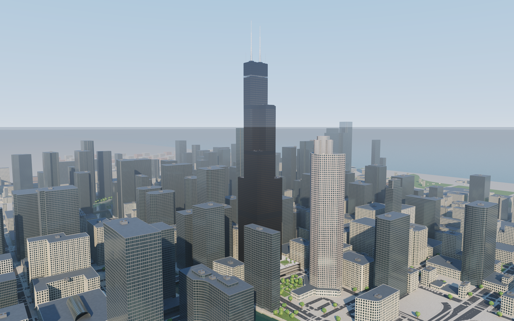
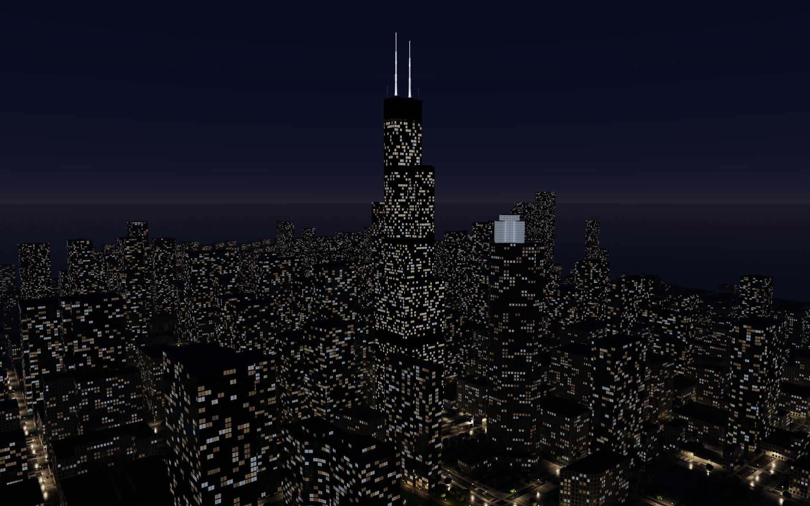

# Atelier

A native Apple Silicon architectural walkthrough engine built with Swift, AppKit, SwiftUI, and Metal hardware ray tracing. Two locations share the same renderer, navigation system, animation controls, day/night lighting, and export tools:

- **Willis Tower, Chicago** — eight views, the nine bundled tubes and their mapped setbacks, individually modeled curtain-wall panels and connections, Catalog entrance and roof garden, Skydeck at its published elevation, five transparent Ledge boxes, broadcast antennas, and mapped Loop surroundings.
- **Eiffel Tower, Paris** — nine views, detailed ironwork and rivets, observation terraces and visitor spaces, mapped gardens and nearby buildings, the Seine, Pont d’Iéna, and a river cruiser.

Nearby layouts use bundled OpenStreetMap snapshots. Architectural photographs, published dimensions, and aerial/satellite references inform the models. These are detailed architectural reconstructions, not surveyed digital twins: interiors, façade treatments, vegetation, boats, and lighting contain authored interpretations. [Willis methodology](docs/WILLIS.md) · [Chicago map data and references](docs/CHICAGO.md) · [Paris methodology](docs/PARIS.md).





## Run

Double-click **Launch Atelier.command**, or run:

```sh
./scripts/build-app.sh
open dist/Atelier.app
```

The launcher rebuilds when source or assets have changed. The packaged app contains both cities and works without network access or the source directory. It opens at Willis Tower. Use the location menu or **L** to switch between Chicago and Paris; loading replaces the active scene's GPU and navigation resources.

Requires macOS 14 or later, the Xcode Command Line Tools with Swift 5.10 or newer to build, and a Metal ray-tracing capable GPU. Hardware validation is performed on this Mac Studio's M3 Ultra with 512 GB unified memory. The build creates an ad-hoc signed, native arm64 app; it is not notarized for distribution to other computers.

## Explore

The opening idle cycle visits each view in order during daytime, switches to night after the last view, visits the sequence again, then returns to day. At 1×, each view lasts 20 seconds. The idle speed controls both the gentle camera motion and the dwell time, independently of walkthrough pace. Selecting a view holds it with gentle motion; **Play** starts that view's own 56-second walkthrough.

| Control | Action |
| --- | --- |
| Location menu / **L** | Switch Chicago ↔ Paris; begin a fresh daytime idle cycle |
| View card / **1–8** (Chicago), **1–9** (Paris) | Select and hold a view |
| **↑ / ↓** | Previous / next view; stop cycling |
| **Idle Play / Idle Pause**, or **I** | Resume the view cycle / hold the current view |
| **[ / ]** | Decrease / increase idle speed: 0.25×, 0.5×, 1×, 2×, 4× |
| **Play / Space** | Start, pause, or resume the selected walkthrough |
| **← / →** | Rewind / fast forward; distinct presses cycle 2×, 4×, 8× |
| **Pace / timeline** | Set walkthrough pace independently / seek |
| **Moon button / Lighting settings** | Change lighting manually; the next idle wrap alternates it |
| **Full-screen button / ⌃⌘F** | Enter / leave native macOS full-screen mode |
| Window edges | Resize freely; viewport aspect and render targets update |
| Mouse drag / WASD / Q–E | Manual look / movement / vertical flight |
| Shift / mouse wheel | Faster movement / adjust manual speed |
| **H / ? / Esc** | Hide interface / show controls / release keys and close help |
| **⌘R / ⌘⇧S** | Reset selected view / save a render to Pictures/Atelier |

Manual movement suspends animation. Walk mode uses floor support and collision checks; Fly mode allows unrestricted inspection. Routes are separate authored chapters, including aerial architectural views, rather than a continuous elevator trip through every floor. Full-screen and ordinary window sizes retain the same rendering and input controls. The view cards scroll horizontally when needed.

## Rendering

The engine traces the actual modeled triangles using Metal acceleration structures, GGX reflections, direct-light shadow rays, and multibounce lighting. Water uses filtered analytic ripple normals and dielectric Fresnel reflections. Selected Chicago glazing uses thin-sheet transmission and reflection; the first camera pane traces both branches to reduce movement noise. [Glass implementation and limits](docs/GLASS.md).

Selective path regularization broadens difficult secondary glossy reflections after a non-delta scatter, reducing bright motion speckles while preserving directly viewed materials and first reflections through perfect glass. This introduces a documented lighting bias; `--no-regularization` disables it for comparisons. [Method and GPU checks](docs/MOTION.md#selective-glossy-path-regularization).

Motion reconstruction uses deterministic world position, depth, normal, material and albedo guides, rejects stale history, and filters within compatible surfaces. Distant night coverage, emissive windows, and mixed reflection/transmission require conservative history handling. Fine sampling grain can remain in reflective water, thin detail, and moving glass. Paused views progressively accumulate samples. [Motion reconstruction](docs/MOTION.md).

| Quality | Maximum render width | Path interactions | New samples/frame |
| --- | ---: | ---: | ---: |
| Interactive | 960 px | 2 | 2 |
| Balanced | 1440 px | 3 | 4 |
| Ultra | 2560 px | 5 | 4 |

Render dimensions preserve the actual drawable's aspect ratio, including portrait windows and full-screen displays; both axes are bounded by the renderer's 8192-pixel limit. GPU memory usage is scene- and viewport-dependent. Unified memory and native ray-tracing acceleration are used directly; allocating all 512 GB is unnecessary for these models.

## Render and record

The command-line interface uses the same scenes and shaders as the application. `--location` defaults to `paris` for compatibility with earlier export commands; choose `chicago` for Willis Tower. View numbers are zero-based on the command line.

```sh
# Geometry, GPU dispatch, accumulation, viewport resizing, and importer checks.
./dist/Atelier.app/Contents/MacOS/ArchitectureEngine --location chicago --self-test

# All eight Chicago viewpoints, including a night gallery.
./dist/Atelier.app/Contents/MacOS/ArchitectureEngine --location chicago \
  --gallery output/chicago-day --width 1920 --height 1200 --samples 128
./dist/Atelier.app/Contents/MacOS/ArchitectureEngine --location chicago \
  --gallery output/chicago-night --lighting 2 --width 1920 --height 1200 --samples 256

# Eight full routes compressed into twelve-second chapters (96 seconds total).
./dist/Atelier.app/Contents/MacOS/ArchitectureEngine --location chicago \
  --video output/Willis-Walkthrough.mp4 --seconds 96 --fps 24 \
  --width 1920 --height 1080 --samples 12

# A complete 56-second night route at its normal playback speed.
./dist/Atelier.app/Contents/MacOS/ArchitectureEngine --location chicago \
  --video output/Willis-Night-Route.mp4 --single-view --stop 7 --lighting 2 \
  --seconds 56 --fps 24 --width 1920 --height 1080 --samples 16

# Inspect a route at a specific time, or export gentle idle motion with --idle.
./dist/Atelier.app/Contents/MacOS/ArchitectureEngine --location chicago \
  --render output/Willis-Ledge.png --stop 5 --at 28 --samples 256

# Keep the complete Paris scene and its nine-view, 108-second export.
./dist/Atelier.app/Contents/MacOS/ArchitectureEngine --location paris \
  --video output/Paris-Walkthrough.mp4 --seconds 108 --fps 24 --samples 12
```

`--camera x,y,z --target x,y,z --fov 60` overrides a still camera. `--raw` disables reconstruction for comparison. `--obj building.obj --scale 1 --render image.png` imports another building for still rendering; imported materials have the limits described in [engine documentation](docs/ENGINE.md). Run `--help` for all options. Video exports require a new filename and never overwrite an existing recording.

Generated videos, high-resolution renders, build products and local reports stay in `output/` or `dist/` and are excluded from Git. [Demo notes](docs/DEMO.md) · [validation](docs/VALIDATION.md).

## Verify and reproduce

```sh
./scripts/validate-playback.sh
./scripts/validate-navigation.sh
swift scripts/validate-metal.swift
swift scripts/validate-denoiser.swift
swift scripts/validate-glass.swift
swift scripts/validate-regularization.swift
python3 scripts/validate-paris-context.py
python3 scripts/validate-chicago-context.py
```

Playback checks cover both cities, camera clearance and floor support, eight/nine-view wrapping, manual selection, independent speeds, transport, location changes, and alternating day/night passes. GPU checks exercise actual Metal kernels, not image mocks. The application self-test also renders landscape, portrait, and wide viewports and checks their camera aspect ratios.

The repository bundles both raw map snapshots and derived geometry. `scripts/prepare-paris-context.py` and `scripts/prepare-chicago-context.py` reproduce the local map databases; see the location documentation for inputs, dependencies, coordinate systems, and known approximations.

Map data **© OpenStreetMap contributors**, available under the **Open Database License (ODbL)**. Attribution is visible in the app and exported video captions. Original and derived map databases retain their ODbL notices under `Resources/Paris/` and `Resources/Chicago/`. Reference photographs and satellite images are consulted visually and are not redistributed as textures or project assets.
