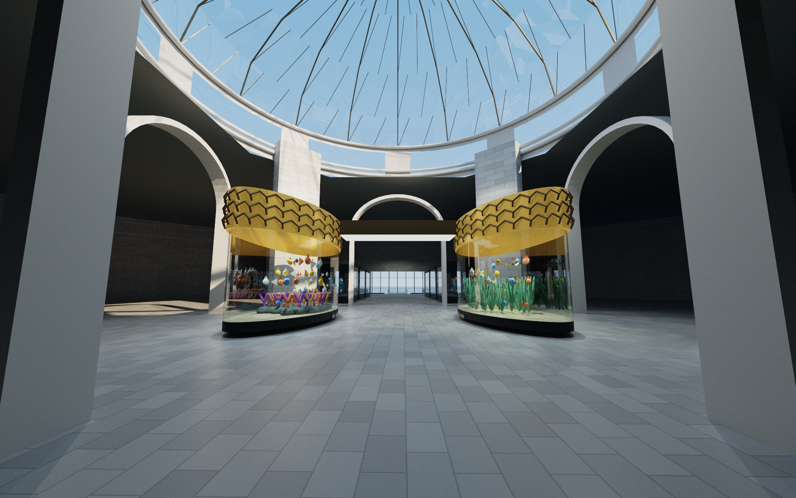

# Robie House and Chicago Demo — Atelier 1.9

The app opens on **Robie House**, the seventh destination. Its first seven views are two-minute architectural studies; its eighth view is the full **six-minute McCormick Place → Robie House flight**. The connection travels south through 31st Street Harbor, the Oakwood lakefront and Promontory Point, then through Hyde Park to the house’s opening bookmark. It uses the same resident Chicago world as all earlier Chicago landmarks.

| View | Study | Duration at 1× |
| --- | --- | --- |
| 1 | A house on the prairie | 120 seconds |
| 2 | The floating roof | 120 seconds |
| 3 | Roman brick and limestone | 120 seconds |
| 4 | Light through art glass | 120 seconds |
| 5 | The hearth at the center | 120 seconds |
| 6 | A room for gathering | 120 seconds |
| 7 | Planes above the garden | 120 seconds |
| 8 | From McCormick Place to Robie House | 360 seconds |

The exterior and selected interior studies follow the consulted plans, maps and restoration photographs; furniture and lighting include authored interpretations. [Robie House architecture and references](ROBIE-HOUSE.md) · [Hyde Park and south lakefront map methodology](HYDE-PARK.md).

Choose **McCormick Place → Robie House** from **Chicago connecting flights** to play the connection while preserving the selected lighting. Outside demo mode, you can also select Robie House view 8 and press **Space**. During a demo, choosing that view or its flight menu item starts it immediately and keeps the demo active. The usual idle cycle and independent walkthrough pace remain available. Press **N** to switch day/night.

Select **Chicago Demo**, or press **C**, to begin at a **random Chicago location and view**. Randomness chooses only the opening; subsequent routes play sequentially through this fixed order:

1. Willis Tower — eight routes.
2. Millennium Park — eight routes, including the Willis–park–Art Institute flight.
3. Chicago Lakefront — eight routes.
4. Museum Campus — eight routes, including the Art Institute–Field Museum flight.
5. Chicago North Side — eight routes, including both four-minute connecting flights.
6. Robie House — seven two-minute house studies and the six-minute McCormick Place connection.

The **48-route pass lasts 86 minutes 36 seconds at 1×**. Starting preserves your chosen lighting, walkthrough pace and idle pace. After Robie House’s final route, the demo returns to Willis Tower and changes day/night. A random opening partway through the city reaches that boundary before its first complete pass. Automatic destination changes retain the same city and GPU resources. Starting from Paris loads Chicago before playback begins; Paris is never part of the sequence.

Selecting **any Chicago location or view keeps the demo active** and starts the chosen route from its beginning, including when the demo was paused or rewinding. A location choice begins its first view; a view card or number key begins that selected view. Ordinary forward playback resumes at your chosen pace. **L** cycles only the Chicago locations while the demo is active.

Use **↑ / ↓**, or the previous/next buttons beside the demo status, to move between routes. From the last view, next advances to the first view in the next location. From the first view, previous goes to the last view in the previous location. Crossing the complete city boundary in either direction changes day/night. The status shows the current destination and route number out of 48.

**Space** pauses or resumes without leaving the demo. **Stop Chicago Demo**, or **C** while it is active, exits while holding the current pose. Selecting Paris, starting idle cycling, clicking an object to focus it, or taking manual camera control leaves the demo. Lighting and pace changes preserve it.

The timeline seeks only within the current route. Rewind and fast-forward shuttles also remain within it: repeated **← / →** presses cycle 2×, 4× and 8×, then pause on reaching the route boundary. From a forward endpoint, **Space** continues the demo into its next route; from a rewound beginning, it resumes forward within that route. Pausing in the middle retains the current direction and shuttle speed.

Click visible building or landmark geometry to focus it; drag to orbit, and scroll with the wheel or trackpad to move closer or farther away. Click the same object again, click sky, or press **Escape** to release focus. **WASD / Q–E** returns to ordinary manual navigation and clears focus. Lighting, resizing and full screen retain the selected focus. [Complete focus behavior and limitations](FOCUS.md).

Drag the native titlebar to move the window, or its edges to resize it. Both camera animation and the traffic/show scene clock hold during these gestures, then resume without catching up to the elapsed wall time. Window resizing updates the viewport and render targets. **⌃⌘F** enters or leaves full screen.

To record another 1080p copy of the complete flight from the packaged app, choose a fresh output filename:

```sh
./dist/Atelier.app/Contents/MacOS/ArchitectureEngine --location robie \
  --video output/McCormick-Place-to-Robie-House-New.mp4 --single-view --stop 7 \
  --seconds 360 --fps 24 --width 1920 --height 1080 --samples 16
```

Add `--lighting 2` and choose a different output filename for a night recording. Without `--single-view`, the default 96-second eight-view export compresses each route into a twelve-second chapter; the live app retains every full timeline.

## Version 1.9 demonstration artifacts

- [Robie House day tour](../output/Robie-House-Day-Tour.mp4): all eight views in **96 seconds**, with seven house studies and the connecting flight compressed into twelve-second chapters. [Media proof](validation/v1.9/robie-house-day-tour-media.json).
- [McCormick Place → Robie House](../output/McCormick-Place-to-Robie-House.mp4): the complete **360-second** flight at its ordinary pace, through 31st Street Harbor, the south lakefront and Hyde Park to the house. [Media proof](validation/v1.9/mccormick-place-to-robie-house-media.json).

Both recordings are silent H.264 at **1280 × 720, 24 FPS and eight samples per frame**, rendered by the final 1.9 package. All **10,944 frames** pass full decoding and uniform timestamp checks. The chapter montage accelerates the full routes; the separate flight retains its complete six-minute timeline. The app retains every two-minute house study and the six-minute connection with independent pace controls. Movies remain local in `output/` and are excluded from Git.

Visual review covered eight chapter midpoints and ten flight samples, with no blocking spatial defect found in those frames. Residual grain, isolated bright speckles and simplified neighborhood/landscape detail remain visible. Sampled frames do not establish continuous motion stability. [Day sample review](validation/v1.9/robie-day-video-review.json) · [Flight sample review](validation/v1.9/robie-flight-video-review.json) · [Validation scope](VALIDATION.md).

The recordings below were made for earlier releases. They remain useful tours of the included architecture, but do not demonstrate or validate the 1.9 additions or revised demo controls. Current check results belong in [validation](VALIDATION.md).

---

## Earlier release: Chicago North Side 1.7

The app opens on **Chicago North Side**, the sixth destination. Old Town, Lincoln Park, the zoo, the conservatory and lily pool, North Avenue Beach, the northern harbors and Wrigleyville extend the existing Chicago landscape. Both connecting flights stay inside that world; all earlier places remain available.

Choose a card to hold its gentle idle animation. **Space** starts or pauses its full route. **← / →** cycle through three shuttle speeds; **N** toggles day/night. **Idle Play / I** cycles all eight studies and alternates daytime and nighttime after each pass. **[ / ]** changes idle pace, independently of walkthrough speed. Use **L** or the location menu to change places, and **⌃⌘F** for full screen. Window resizing updates the viewport.

| View | Study | Duration at 1× |
| --- | --- | --- |
| 1 | Millennium Park → Lincoln Park Zoo, via the north lakefront | 240 seconds |
| 2 | St. Michael's, Old Town rooftops and Wells Street | 120 seconds |
| 3 | North Avenue Beach House, promenade and Lake Michigan | 120 seconds |
| 4 | South Pond, woven pavilion and Nature Boardwalk | 120 seconds |
| 5 | Lincoln Park Zoo's historic houses and public mall | 150 seconds |
| 6 | Conservatory gardens and the Alfred Caldwell Lily Pool | 120 seconds |
| 7 | Lincoln Park Zoo → Wrigley Field, via Diversey and Belmont harbors | 240 seconds |
| 8 | Wrigley Field, Gallagher Way, marquee, ivy and the playing field | 150 seconds |

The **Chicago connecting flights** menu contains four connections: Willis–Millennium–Art Institute, Art Institute–Field Museum, Millennium–Lincoln Park Zoo, and Zoo–Wrigley. Each keeps the selected lighting and starts its own full timeline. The five Chicago destinations share one resident world; Paris loads its independent scene.

Zoo night lighting is an original **seasonal ZooLights-inspired interpretation**, not a claim about the current installed display or year-round zoo lighting. Wrigley's white field banks, red marquee and restrained blue accents follow the consulted nighttime references. The architecture follows dated map footprints, with photograph-informed details and representative planting, people and boats; it is not a surveyed digital twin.

## Version 1.7 demonstration artifacts

- [North Side by day](../output/Chicago-North-Side-Day-1080p.mp4): all eight routes in 96 seconds.
- [Millennium Park to Lincoln Park Zoo](../output/Millennium-Park-to-Lincoln-Park-Zoo-1080p.mp4): the complete four-minute connecting flight.
- [Lincoln Park Zoo to Wrigley Field](../output/Lincoln-Park-Zoo-to-Wrigley-Field-1080p.mp4): the complete four-minute flight through Diversey and Belmont harbors.
- [North Side at night](../output/Chicago-North-Side-Night-1080p.mp4): all eight routes in 96 seconds, including colored zoo lights and the illuminated stadium.

These silent recordings use the packaged renderer at 1920 × 1080 and 24 FPS. The day montage uses 16 samples per frame, each connecting flight uses 12, and the night montage uses 24. The montages accelerate the full routes into twelve-second chapters; both flights retain their ordinary four-minute timelines. Movies remain local in `output/` and are excluded from Git. The app retains the full routes and independent pace controls. [Validation and sampled visual reviews](VALIDATION.md).


## Export the North Side

```sh
./dist/Atelier.app/Contents/MacOS/ArchitectureEngine --location northside \
  --video output/Millennium-Park-to-Lincoln-Park-Zoo.mp4 --single-view --stop 0 \
  --seconds 240 --fps 24 --width 1920 --height 1080 --samples 16

./dist/Atelier.app/Contents/MacOS/ArchitectureEngine --location northside \
  --video output/Lincoln-Park-Zoo-to-Wrigley-Field.mp4 --single-view --stop 6 \
  --seconds 240 --fps 24 --width 1920 --height 1080 --samples 16
```

The default 96-second multi-view export without `--single-view` compresses each complete route into a twelve-second chapter. A custom `--seconds` duration is divided evenly among the eight chapters. The live app retains the full timelines. All exports use uniform presentation timestamps independent of rendering wall time.

---

## Earlier release: Museum Campus 1.6

The app opens on **Museum Campus**, the fifth destination. The Field Museum, Shedd Aquarium, Adler Planetarium, Soldier Field, Burnham Harbor and all four McCormick Place buildings inhabit the existing Chicago world. The lakefront continues south with mapped buildings, boats and light traffic.

Select a view to hold its gentle idle animation. **Space** starts or pauses that view's route; **← / →** shuttle at 2×, 4× and 8× with repeated presses. **N** toggles day/night without restarting the camera. **Idle Play / I** cycles all eight studies, changing day/night after each complete pass; **[ / ]** adjusts idle speed independently of the walkthrough pace. **L** changes locations. Full-screen and resizable windows remain available.

| View | Study | Duration at 1× |
| --- | --- | --- |
| 1 | Art Institute → Field Museum: continuous flight across Grant Park into the hall | 180 seconds |
| 2 | Field Museum north portico and Stanley Field Hall | 120 seconds |
| 3 | Shedd south approach, Wonder of Water rotunda and oceanarium | 120 seconds |
| 4 | Adler exterior, gallery and entrance into the dome theater | 150 seconds |
| 5 | Original planetarium light show, with a closed camera loop | 180 seconds |
| 6 | Soldier Field colonnades, modern bowl and descent toward the field | 90 seconds |
| 7 | Burnham Harbor piers, moored boats and skyline | 90 seconds |
| 8 | McCormick Place halls, roof systems, gardens, hotels and skywalks | 180 seconds |

The **Chicago connecting flights** menu contains both the new Art Institute–Field Museum flight and the original four-minute Willis–Millennium Park–Art Institute flight. Both preserve the chosen lighting. All four Chicago destinations reuse the resident city and its acceleration structures; Paris has its own world.

The dome program is original, with a 180-second deterministic cycle of stars, line constellations, aurora ribbons and a stylized planet. It is not an ephemeris or a reproduction of a commercial Adler presentation. Camera and show share the same clock for play, pause, seeking and rewind. Museum routes cover selected connected public spaces; exhibits and circulation details are architectural interpretations, not a complete museum inventory.

## Version 1.6 demonstration artifacts

- [Museum Campus by day](../output/Chicago-Museum-Campus-Day-1080p.mp4): all eight routes in 96 seconds, with twelve-second chapters.
- [Art Institute to Field Museum](../output/Art-Institute-to-Field-Museum-1080p.mp4): the complete three-minute continuous flight at its ordinary pace, ending inside Stanley Field Hall.
- [Adler light show](../output/Adler-Planetarium-Light-Show-1080p.mp4): the complete three-minute original dome program and camera loop.
- [Museum Campus at night](../output/Chicago-Museum-Campus-Night-1080p.mp4): all eight routes in 96 seconds, including illuminated interiors, boats and convention buildings.

The recordings use the packaged renderer at 1920 × 1080 and 24 FPS. The day, connecting flight and dome exports use 16 samples per frame; the night montage uses 24. They are silent. The two montages accelerate each route and its scene clock to fit the chapter, while the connecting flight and dome program retain their full 180-second duration. Movies remain local in `output/` and are excluded from Git. The interactive app keeps every route's full duration and independent speed controls. Final decoding, timing and sampled visual evidence is linked from [Validation](VALIDATION.md).



## Export the new routes

```sh
./dist/Atelier.app/Contents/MacOS/ArchitectureEngine --location campus \
  --video output/Art-Institute-to-Field-Museum.mp4 --single-view --stop 0 \
  --seconds 180 --fps 24 --width 1920 --height 1080 --samples 16

./dist/Atelier.app/Contents/MacOS/ArchitectureEngine --location campus \
  --video output/Adler-Planetarium-Light-Show.mp4 --single-view --stop 4 \
  --lighting 2 --seconds 180 --fps 24 --width 1920 --height 1080 --samples 16
```

Full route exports use their ordinary timeline. A multi-view 96-second export compresses each complete route into a 12-second chapter for a short overview. All exports use uniform presentation timestamps regardless of rendering speed.

---

## Earlier release: Chicago Lakefront 1.5

The app opens on **Chicago Lakefront**, a fourth destination covering the Magnificent Mile, Grant Park, harbors and DuSable Lake Shore Drive. It shares the same physical world as Willis Tower and Millennium Park. Use **L** or the location menu to select any destination.

Each of the eight bookmarks has a gentle idle animation and a complete independent route. **Space** plays or pauses the current route. **N** switches day/night without changing the selected view, restarting the route or releasing pause. The moon button performs the same action. **Idle Play / I** cycles the bookmarks, alternating day and night after each complete pass; **[ / ]** changes idle speed. Choosing a bookmark holds it.

| View | Study | Route duration at 1× |
| --- | --- | --- |
| 1 | The Magnificent Mile — Michigan Avenue's architectural corridor | 90 seconds |
| 2 | A survivor in limestone — the historic Chicago Water Tower | 56 seconds |
| 3 | Water Tower Place — retail frontage and tower | 56 seconds |
| 4 | The Hancock's great diagonals — taper, X braces and antennas | 56 seconds |
| 5 | Buckingham Fountain — tiers, sculpture, water and light | 56 seconds |
| 6 | Chicago's front yard — Grant Park gardens | 56 seconds |
| 7 | Harbors on Lake Michigan — piers and moored boats | 56 seconds |
| 8 | Along Lake Shore Drive — lakefront flight with light traffic | 120 seconds |

The three Chicago destinations retain one resident city scene. The **Willis → Park → Art Institute** button still starts the original continuous four-minute flight and preserves your lighting choice. All previous Eiffel, Willis and Millennium Park routes remain available.

## Record the lakefront

```sh
# Eight full routes compressed into twelve-second chapters.
./dist/Atelier.app/Contents/MacOS/ArchitectureEngine --location lakefront \
  --video output/Chicago-Lakefront-Tour.mp4 --seconds 96 --fps 24 \
  --width 1920 --height 1080 --samples 16

# The complete two-minute Lake Shore Drive route at night.
./dist/Atelier.app/Contents/MacOS/ArchitectureEngine --location lakefront \
  --video output/Lake-Shore-Drive-Night.mp4 --single-view --stop 7 \
  --lighting 2 --seconds 120 --fps 24 --width 1920 --height 1080 --samples 24

# Freeze both camera and traffic at a selected route time for a still.
./dist/Atelier.app/Contents/MacOS/ArchitectureEngine --location lakefront \
  --render output/Lakefront-At-40s.png --stop 7 --at 40 \
  --width 1920 --height 1200 --samples 256
```

Chaptered exports compress each full route into its chapter. Camera and traffic both follow that compressed clock and reset together at each cut; the single-view two-minute recording retains the full Lake Shore Drive timeline.

Traffic is deterministic at a given scene time. Rewind, fast forward and timeline seeking place vehicles at the corresponding route time; pausing lets the entire image converge. Moored harbor boats remain stationary. Fresh export filenames are required. [Lakefront geography and references](LAKEFRONT.md) · [Landmark architecture and references](MAGNIFICENT-MILE.md).

## Version 1.5 demonstration artifacts

- [Chicago Lakefront by day](../output/Chicago-Lakefront-Day-Walkthrough-1080p.mp4): all eight routes in a 96-second 1080p tour, with twelve-second chapters. Camera and traffic share the accelerated chapter clock. [Media proof](validation/v1.5/day-tour-media.json).
- [Lake Shore Drive at night](../output/Lake-Shore-Drive-Night-1080p.mp4): the complete two-minute flight at 1080p, with moving traffic, shoreline lights and harbor reflections. [Media proof](validation/v1.5/night-drive-media.json).
- [Magnificent Mile by day](images/Chicago-Magnificent-Mile-Day.png) and [Buckingham Fountain at night](images/Chicago-Buckingham-Fountain-Night.png): reviewed 1600 × 1000 stills included in the repository.

Both movies use 24 FPS, three path interactions and the final motion reconstruction. Every frame decodes with uniform timing; sampled visual review covers all day chapters and ten points along the night flight. Videos remain local in `output/` and are excluded from Git. The app retains each route's full interactive duration and independent pace controls.

The records below preserve preceding releases and their original demonstrations.

## Millennium Park and the continuous Chicago flight — Atelier 1.4

The app now opens on **Millennium Park**, the third destination. Willis Tower and the park occupy one continuous Chicago world; changing between their bookmark sets keeps the same scene resident. Paris remains available from the location menu or **L**.

Select **From tower to museum** (view 8) and press **Space**, or use **Willis → Park → Art Institute** from either Chicago destination. The four-minute route departs Willis Tower, crosses above the Loop, descends to Cloud Gate, visits the park and enters a modeled Modern Wing gallery. The flight button preserves the chosen day/night mode. The **Pace** selector, timeline and 2×/4×/8× arrow-key shuttle all use the full four-minute route. Space pauses exactly where you are.

The other seven park bookmarks have their own 56-second routes and gentle idle movement. **Idle Play / I** cycles all eight views, switching day/night after each complete pass. Choosing a view holds it; **[ / ]** adjusts idle speed independently. The Bean reflects the actual shared Chicago geometry and lighting.

| View | Architectural study |
| --- | --- |
| 1 | Chicago's garden of art — park and skyline overview |
| 2 | A city in the Bean — orbiting Cloud Gate |
| 3 | Beneath Cloud Gate — walk through the reflective underside |
| 4 | Music under the skyline — Pritzker Pavilion and the Great Lawn |
| 5 | Water, glass and light — Crown Fountain |
| 6 | A garden and a bridge — Lurie Garden and Nichols Bridgeway |
| 7 | The Art Institute — Michigan Avenue entrance and museum architecture |
| 8 | From tower to museum — continuous four-minute Chicago flight |

The map positions and published landmark envelopes constrain the reconstruction. Millennium Park has its own bundled OpenStreetMap extract, sharing Willis Tower’s coordinate origin. Fine surfaces, planting, the sculptural shell and museum gallery arrangement are authored interpretations. The Art Institute combines its historic entrance and bronze-lion interpretations with a glazed Modern Wing, Nichols Bridgeway and an original exhibition room; it does not reproduce the current collection hang. [Park sources](MILLENNIUM.md) · [Museum sources](ART-INSTITUTE.md) · [Renderer improvements](MOTION.md).

Cloud Gate reflects the actual Chicago geometry, with multiple reflections in its concave underside. Scrambled Sobol sampling distributes rays more evenly across the sampling domain; stable GGX evaluation and pure-metal sampling preserve the polished reflection lobe. Consecutive very smooth metal reflections retain their authored roughness until an ordinary surface scatter begins selective path regularization. Fine sampling grain and reconstruction softness can still be visible during motion.

The museum uses neutral warm-white interior fixtures during both day and night. Exterior washes, roof lights and bridge lights switch on at night. A conservative light grid avoids evaluating distant sources outside their finite support, retains scene candidate order and falls back to a linear list if necessary. `--random-sampling`, `--no-regularization` and `--linear-lights` provide independent comparison modes; `--raw` disables motion reconstruction for video comparisons.

## Recording and checking the new flight

The following command records the complete Chicago flight at its ordinary pace:

```sh
./dist/Atelier.app/Contents/MacOS/ArchitectureEngine --location millennium \
  --video output/Chicago-Park-Museum-Flyby.mp4 --single-view --stop 7 \
  --seconds 240 --fps 24 --width 1920 --height 1080 --samples 16
```

Choose a new output filename and add `--lighting 2` for night. The ordinary 1× route lasts 240 seconds; `--seconds` changes the recording’s duration while traversing the same complete route. The final frame includes the museum endpoint. Without `--single-view`, the park exporter instead creates eight compressed chapters, defaulting to 96 seconds. Individual studies use `--single-view --stop 0` through `--stop 6` and default to 56 seconds. `--idle` records the selected bookmark’s gentle movement independently of the app’s current controls.

The [README verification commands](../README.md#verify-and-reproduce) cover the three map snapshots, landmark mesh, conservative light-grid coverage, navigation, playback and the full four-minute clock. They also include the Metal, glass, denoising, path-regularization, Sobol/polished-GGX and indexed-lighting GPU checks. `--location millennium --motion-test output/millennium-motion` exercises actual Bean idle, orbit, night and underside sequences against higher-sample references; `--motion-case` selects one case. The demonstration records below include export settings, complete decoding, exact frame timing and sampled visual checks, separate from the motion benchmark’s image-error measurements. `scripts/validate-video-timing.py` validates an existing recording’s full decode and cadence.

`scripts/prepare-millennium-context.py` reproduces the third derived map database from its bundled raw snapshot; the Paris and Chicago preparation commands remain available. No network access is needed to run the app or regenerate these recorded map extracts.

## Version 1.4 demonstration artifacts

- [Willis → Millennium Park → Art Institute](../output/Chicago-Willis-Park-Art-Institute-1080p.mp4): the continuous four-minute daytime flight, 1920 × 1080, 24 FPS, 16 samples/frame and three path interactions. All **5,760 frames** decode successfully with uniform frame timing. [Media report](validation/v1.4/day-flyby-media.json).
- [Cloud Gate at night](../output/Cloud-Gate-Night-Walkthrough-1080p.mp4): the complete 56-second orbit, 1920 × 1080, 24 FPS, 24 samples/frame and three path interactions. All **1,344 frames** decode successfully with uniform frame timing. [Media report](validation/v1.4/night-bean-media.json).
- [Cloud Gate by day](../output/Millennium-Cloud-Gate-Day.png) and [by night](../output/Millennium-Cloud-Gate-Night.png): 1920 × 1200, respectively 256 and 512 samples. Visually reviewed copies are retained in `docs/images/`.

| Time | Continuous flight landmark |
| --- | --- |
| 00:00 | Willis Tower departure |
| 00:42 | Crossing above the Loop |
| 01:28 | Millennium Park descent |
| 01:48 | Approaching Cloud Gate |
| 02:37 | Pritzker Pavilion |
| 03:13 | Lurie Garden |
| 03:27 | Modern Wing approach |
| 03:45 | Griffin Court |
| 03:50 | Entering the interpreted gallery |
| 04:00 | Museum endpoint |

The complete movies passed FFmpeg decoding and timestamp checks. Visual review samples 16 points along the flight and nine points in the night orbit; it does not inspect every frame. Fine sampling grain remains in difficult moving reflections, especially the first frame before history develops. The polished Bean reflects the rendered Chicago world; the museum's gallery and artwork are authored interpretations. Videos remain local under `output/` and are excluded from Git. The commands above reproduce them.

The existing Willis and Paris demonstrations below document preceding releases. They are historical artifacts and do not certify the new park’s motion quality or current quality-preset performance.

## Chicago and Paris demonstrations — Atelier 1.3

Atelier 1.3 opened on Willis Tower with eight animated bookmarks. **L** or the location menu switched to Paris and its nine bookmarks. Every bookmark started an independent 56-second walkthrough; Space started/paused it. Idle Play (**I**) automatically visited the bookmarks, switching from day to night after the final view and back to day after the next pass. **[ / ]** adjusted its speed independently of walkthrough pace. These controls remain available in 1.4 alongside the new four-minute route. Native full-screen uses **Control–Command–F** or the toolbar button.

Chicago's eight chapters cover the tower skyline, Catalog entrance, close curtain wall, rooftop garden, Skydeck, five glass Ledge boxes, antenna crown, and South Branch river/boat/bridges. Published dimensions, OSM geometry and visually inspected photographs inform the reconstruction; authored interiors, façades and lighting remain interpretations. [Willis references](WILLIS.md) · [Chicago references](CHICAGO.md).

The 1.3 videos were generated locally under `output/` and are intentionally excluded from Git. The command-line examples in the repository README render fresh videos of the current scenes. An eight-view Willis tour lasts 96 seconds with the complete routes compressed into twelve-second chapters; a nine-view Paris tour lasts 108 seconds. `--single-view --seconds 56` records one of those routes at its ordinary 1× speed. `--idle` records the selected view's gentle drift.

## Version 1.3 demonstration artifacts

These local files show the final 1.3 Chicago geometry and renderer. They are excluded from Git; current app exports retain the same Willis routes while including subsequent scene and renderer changes.

- [Day walkthrough](../output/Willis-Chicago-Day-Walkthrough-1080p.mp4): eight chapters, 96 seconds, 1920 × 1080, 24 FPS, 16 samples/frame and three path interactions. The complete recording decodes successfully and all eight chapter midpoints passed visual review. [Media report](validation/v1.3/day-media.json).
- [Night walkthrough](../output/Willis-Chicago-Night-Walkthrough-1080p.mp4): all eight chapters, 96 seconds, 1920 × 1080, 24 FPS, 24 samples/frame and three path interactions. Full decoding and all eight chapter-frame reviews passed. [Media report](validation/v1.3/night-media.json).
- [Day overview](../output/Willis-Tower-Day.png) and [night overview](../output/Willis-Tower-Night.png): 1920 × 1200, respectively 256 and 512 samples. Both were visually reviewed; copies are included in `docs/images/` for the GitHub README.

| Time | Chicago chapter |
| --- | --- |
| 00:00 | Chicago's great tower |
| 00:12 | Welcome to Catalog |
| 00:24 | Black aluminum, bronze glass |
| 00:36 | A garden above the Loop |
| 00:48 | Inside the Skydeck |
| 01:00 | Out on the Ledge |
| 01:12 | Crown of the skyline |
| 01:24 | Along the Chicago River |
| 01:36 | End |

The films compress each complete 56-second route into a twelve-second chapter. In the app, each walkthrough plays at its independent adjustable pace. The earlier bright secondary-reflection speckles were corrected with selective path regularization; fine sampling grain and some reconstruction softness remain. [Method and limits](MOTION.md#selective-glossy-path-regularization).

## Earlier Paris demonstrations

The following notes describe earlier Paris releases; use `--location paris` explicitly for clarity when reproducing their exports.

# Eiffel walkthrough · v1.2

Open **Atelier.app** from `dist`, or double-click **Launch Atelier.command**. The app starts a gentle sequence through all nine views in order, with 20 seconds per view at the default idle speed. Selecting any view with **↑ / ↓**, **1–9**, or a view button stops the sequence and holds that view's gentle camera motion.

The separate **Idle Play / Idle Pause** button, or **I**, starts or stops automatic view switching. Idle Play begins from the current view and gives it a full dwell before advancing. Idle Pause keeps that view's gentle motion. **Idle Speed** has five settings: **0.25×, 0.5×, 1×, 2×, and 4×**. Press **[** to slow down or **]** to speed up. This setting scales both camera drift and view switching: each view lasts 80, 40, 20, 10, or 5 seconds respectively. It does not change walkthrough pace.

The main **Play** button or **Space** starts the current view's 56-second walkthrough and stops idle cycling. Press again to pause, and again to resume from the same time. A paused walkthrough freezes completely. **← / →** latch rewind and fast forward; repeated presses cycle 2×, 4×, and 8×, and an opposite press starts at 2×. Holding an arrow does not change the setting. **Pace** adjusts the walkthrough's base speed from 0.25× to 4×; the transport label shows the effective speed after the shuttle multiplier. Drag the timeline to seek. Playback pauses at either end, and Space at the forward endpoint restarts the selected view.

Click the viewport and use **WASD** plus drag for manual exploration. Q/E changes height in Fly mode; the mouse wheel changes manual movement speed. Manual navigation stops automatic view switching and takes control of the camera. **H** hides the interface. Settings switches Walk/Fly, quality, lighting and exposure.

For the night overview, press **1**, select the **moon button**, and leave the selected view held for a very slow orbit: 0.35 degrees per second at 1× Idle Speed. Press Space for the complete, faster orbit. **Settings → Lighting → Night** provides the same lighting mode. Press **9** to explore the Seine, sightseeing cruiser and five arches of Pont d’Iéna. The river route is a scenic camera flight over the water. Reflections use the traced scene geometry. See [night references](NIGHT.md) and [river references](RIVER.md).

The nine routes are independent studies: full overview orbit, ground approach beneath the arches, riveted connection and stair detail, first terrace, pavilion aisle, second terrace, summit panorama, exterior sweep, and the Seine with Pont d’Iéna and a river cruiser. The updated Anatomy of iron camera and route reveal the rivet plate while retaining foreground beams along the lower part of the frame. Nearby streets, gardens and building footprints use OpenStreetMap data; facade articulation, planting and the boat are authored interpretations. Map data © [OpenStreetMap contributors](https://www.openstreetmap.org/copyright).

Moving previews and new videos use [GPU motion reconstruction](MOTION.md). The v1.2 playback regression passes 7,334 checks, including the idle controls, 560 walkthrough camera steps per view and 120 seconds of idle camera movement per view. All nine routes pass the tested body-clearance checks; supported walking routes also pass floor-support checks.

## Version 1.2 demonstration artifacts

- [Nine-view daytime tour](../output/Eiffel-Paris-v3-Walkthrough-1080p.mp4): 108 seconds at 1920 × 1080 / 24 FPS, eight samples/frame and three path interactions. All 2,592 frames fully decoded; all nine chapter midpoints inspected.
- [Complete night river walkthrough](../output/Seine-v3-Night-Walkthrough.mp4): the full 56-second ninth route at 1×, 1440 × 900 / 24 FPS, twelve samples/frame and three path interactions. All 1,344 frames fully decoded; frames at 2, 14, 28, 42 and 54 seconds inspected.
- [Daytime Paris still](../output/Eiffel-Paris-v3-Day.png) and [night river still](../output/Seine-Pont-Iena-v3-Night.png): both 1920 × 1200, respectively 256 and 512 samples, visually reviewed.

The movies use the final version 1.2 scene and motion reconstruction. Captions and map attribution are readable. Fine noise remains in difficult night reflections; the pavilion interior is comparatively dim. [Day media report](../output/v3-review/day-media-validation.json) · [Night media report](../output/v3-review/night-media-validation.json).

## Recording the nine Paris views

`--video output/name.mp4 --single-view --stop N` records one complete selected route; indices are zero-based, 0–8. The default duration is 56 seconds, and `--seconds` stretches or compresses that route. Add `--lighting 2` for night. `--idle --stop N --seconds 20` records 20 seconds of that single view's idle movement at 1×, independent of the app's current settings. `--raw` disables motion reconstruction in a video for comparison. Choose a new filename for every video export.

Without `--single-view` or `--idle`, the exporter records all nine complete routes with chapter cuts, defaulting to **108 seconds**. Each full route is compressed into a 12-second chapter; live playback gives each selected route its full 56 seconds at 1×.

| Time | Chapter |
| --- | --- |
| 00:00 | The Paris skyline |
| 00:12 | Beneath the arches |
| 00:24 | Anatomy of iron |
| 00:36 | The first terrace |
| 00:48 | The visitor pavilion |
| 01:00 | Above the city |
| 01:12 | The summit gallery |
| 01:24 | A structure in light |
| 01:36 | The Seine & Pont d’Iéna |
| 01:48 | End |

## Earlier v1.1 demonstration artifacts

These files were rendered for **v1.1**. Their `v2` filename denotes the second recording, not the current v1.2 application. They show the earlier eight-view scene and precede the new map-based surroundings, revised ironwork framing, river cruiser, detailed bridge and idle cycling controls.

- [Earlier eight-view walkthrough](../output/Eiffel-Walkthrough-v2-1080p.mp4): a 96-second chaptered recording at 1920 × 1080 / 24 FPS, 8 samples per frame and three path interactions.
- [Earlier night walkthrough](../output/Eiffel-Night-Walkthrough-1080p.mp4): the full 56-second overview orbit at 1×, 1920 × 1080 / 24 FPS, 12 samples per frame and three path interactions.
- [Earlier night tower still](../output/Eiffel-Tower-Night.png): 2560 × 1600 at 256 samples, rendered and visually reviewed.

Both v1.1 movies use GPU motion reconstruction. Full decoding passed for all 2,304 daytime frames and 1,344 night frames. All eight chapter midpoints and five points in the night orbit were visually reviewed.

The v1.1 motion regression, after fixing bright silhouette trails, passed on 48-frame, 960 × 600 sequences with four samples per frame against independent 128-sample references. Temporal residual error fell 31.64% for the overview, 40.70% for ironwork and 12.54% for the night silhouette; image RMSE fell 10.14%, 30.60% and 3.93%, respectively. Night dark-city and clear-sky error also passed explicit ghosting thresholds. These measurements cover those specific earlier scenes and motions; timing fields were captured while two movie exports shared the GPU. [Results and method](VALIDATION.md#motion-reconstruction-checks).

## Original v1.0 artifacts

The original [1080p movie](../output/Eiffel-Walkthrough-1080p.mp4) runs for 96 seconds at 24 FPS, rendered at 64 samples per frame with four path interactions. It is a silent, chaptered visual tour of the original short camera moves. It predates the per-view routes, night lighting and motion reconstruction.

The original [4K overview](../output/Eiffel-Tower-4K.png) uses 512 samples and five path interactions. The original [chapter gallery](../output/final-review/) contains eight additional stills at 1440 × 960.

The tower, connection details and pavilion interiors remain procedural architectural interpretations. Published tower dimensions establish scale, while layouts and detail placement are reconstructed. See [MODEL.md](MODEL.md) for provenance and accuracy boundaries, and [VALIDATION.md](VALIDATION.md) for the completed checks.
