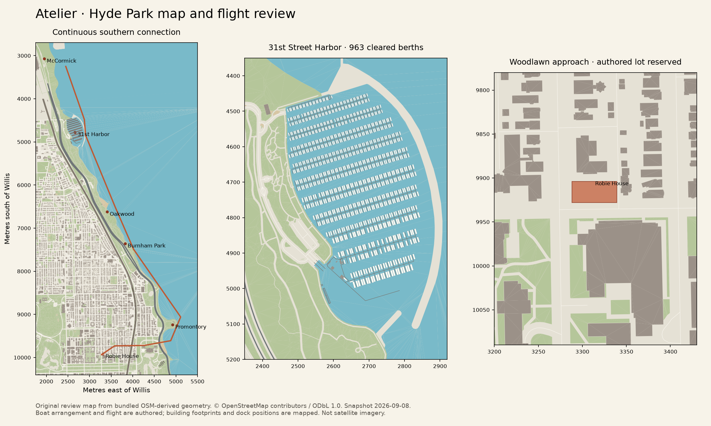

# Hyde Park and the southern Chicago connection

Atelier's Robie House destination extends the same Chicago world from McCormick Place along the lakefront to Hyde Park. The six-minute connecting flight passes 31st Street Harbor, Oakwood Beach, Burnham Park and Promontory Point, then approaches the house through 57th Street and Woodlawn Avenue. The house and its seven closer studies are documented in [ROBIE-HOUSE.md](ROBIE-HOUSE.md).

The extension adds 14,478 mapped building records, 13,520 road and path records, 272 rail segments and 1,179 mapped tree nodes, plus deterministic canopy samples inside mapped woodland and the Point's planted border. Canopy positions are regenerated against the road and sidewalk clearance polygons. Nearby Hyde Park facades receive individual windows, stone surrounds, cornices, storefront glazing, awnings and entrances; farther buildings use fewer window bays and floors. Building roofs preserve the holes of mapped courtyards. The model includes contextual cues for Rockefeller Chapel, the Harper Center and the Promontory Point field house; these secondary buildings are exterior interpretations rather than complete architectural models.

31st Street Harbor contains 963 modeled sailboats and motorboats placed along actual mapped finger docks. Hull footprints are checked against the harbor boundary, docks and previously accepted boats. The harbor operator documents 1,000 slips; the model depicts a representative busy summer day, not a live vessel inventory. Dock pedestals, warm cabin lights and the shore building's lower glazed frontage carry into the night scene. [Official harbor description and photographs](https://www.chicagoharbors.info/harbors/31st-street/).

The southern Lake Shore Drive continuation preserves every existing traffic lane sample, then adds its exact connected OSM way chains. Land and water are triangulated separately in the new strip from south coordinate 7,800 m to 10,800 m. Older Chicago terrain and source resources remain byte-for-byte unchanged. The resource is loaded offline, and the new geometry shares existing water materials, deterministic lighting and the same renderer.

## Sources and visual references

The saved Overpass query covers latitude 41.782–41.850 and longitude −87.632–−87.573. The corridor extract's OSM timestamp is **2026-09-08T22:09:44Z**. Lake Michigan's relation 1205149 supplies the extended coastline; relation 17779015 supplies the 31st Street Harbor water outline; relation 15772175 supplies Promontory Point; way 125667497 supplies Robie House's mapped footprint. The bundled derivative stores raw source SHA-256 hashes, prior derivative hashes and explicit height provenance.

Photographs and satellite views were actually inspected on September 8, 2026:

| Reference | Observations used |
| --- | --- |
| [SITE Design Group: 31st Street Harbor](https://www.site-design.com/projects/31st-street-harbor/) | The landscape architect's large aerial shows the curved protective breakwater, repetitive finger slips, green-roof shore garage and the band of parkland between the harbor, highway and residential buildings. |
| [Chicago Harbors: night dock photograph](https://www.chicagoharbors.info/wp-content/uploads/2013/04/31st-street-night-dock-568x320.jpg) | Low white service pedestals illuminate timber dock surfaces; warm boat cabins appear against a dark harbor. This informs the restrained lighting rather than arbitrary colored floodlights. |
| [Park District: Promontory Point](https://www.chicagoparkdistrict.com/parks-facilities/promontory-point) | Limestone field-house tower, dark pitched roof, mature tree canopy and broad open lawn. The page identifies Alfred Caldwell's naturalistic landscape and the lakefront beach sequence. |
| [Park District: Burnham Wildlife Corridor](https://www.chicagoparkdistrict.com/parks-facilities/burnham-wildlife-corridor) | Prairie, savanna and woodland on both sides of Lake Shore Drive, with paved and woodchip paths between McCormick Place and 47th Street. |
| [Satellite view: Woodlawn/58th Street](https://www.google.com/maps/@41.790133,-87.594778,640m/data=!3m1!1e3) | Robie House's narrow east–west lot, Harper Center south across 58th Street, Rockefeller/Institute buildings west, tree-lined residential blocks east and Metra rail corridor farther east. |
| [Satellite view: Promontory Point](https://www.google.com/maps/@41.795987,-87.578507,1280m/data=!3m1!1e3) | The Point's rounded outline and tree border, looping footpath, central lawn, highway curve and 57th Street beach. |

Satellite imagery is credited in the source viewer to Airbus, Maxar Technologies and Vexcel Imaging US, with Google map data. It is used for visual interpretation only. No third-party photograph, map tile or satellite texture is bundled. OSM-derived resources and reproducible raw sources retain **© OpenStreetMap contributors / ODbL 1.0** attribution. [OSM license](https://www.openstreetmap.org/copyright).



## Reproduction and verification

Run the preparation and data validator in a Python environment with Shapely 2.1.2; the app itself does not require Python or a network connection:

```sh
python scripts/prepare-hyde-park-context.py
python scripts/validate-hyde-park-context.py
python scripts/validate-hyde-park-roads.py
scripts/validate-hyde-park-geometry.sh
```

The preparation reads the saved September 8 extracts and previous resources. It does not fetch new data or change earlier derivatives. All coordinates retain the Willis origin, metres east/south from latitude 41.878876, longitude −87.635918. OSM horizontal coordinates are rounded to millimetres to stabilize geometric overlay operations; this is numeric precision, not a claim of survey accuracy.

The original 1.9.0 context mesh added **4,919,716 triangles** and 743 lights. Its CPU-only build took 1.90 seconds on the development machine; this is geometry construction time, not an interactive frame-rate measurement. The 46,350 data checks passed, and the mesh contained no collapsed triangles or nonfinite vertex values. Updated road mesh and validation results are recorded under version 1.9.1 in [VALIDATION.md](VALIDATION.md).

The data validator checks source hashes, duplicate IDs, open courtyard triangulation, the authored Robie lot exclusion, boat/dock/water clearance and exact retention of earlier traffic sequences. The CPU mesh validator checks the geometry budget, finite positions and normals, noncollapsed triangles, material indices and the complete north–south lane extent. The release's application and GPU checks are reported separately in [VALIDATION.md](VALIDATION.md).

## Modeling limits

This is a continuous architectural visualization, not a surveyed digital twin. Mapped outlines and tagged heights are distinguished from estimated heights and interpreted facades. Elevations follow the existing flat Chicago scene: Lake Michigan is at −5.7 m in this local coordinate system, and rail grades are simplified. At 57th Street, six short bridge-tagged roadway and trail pieces now meet their adjoining surface grades; treating their relative OSM `layer` tags as absolute seven-metre elevations previously produced floating slabs. The Park District documents two pedestrian underpasses here; the current model omits underground paths and does not reconstruct their excavations or claim surveyed road elevations. Elsewhere, unmapped overpass heights retain the earlier clearance approximation. [Park District underpass description](https://www.chicagoparkdistrict.com/parks-facilities/57th-street-underpass-mural-artwork).

Version 1.9.1 prepares connected ground-level carriageway polygons with bounded miter joins, unions intersecting paths, and trims walking surfaces against roadways. Explicit one-lane tags determine ramp widths. Mapped or absent sidewalks suppress generated strips, and highway links receive no invented sidewalks. The offline resource retains the source tags and modeling provenance; earlier Chicago resources and traffic samples remain unchanged. Small park props and distant construction details are still simplified.

The Robie lot reserves x = 3288–3339 and z = 9904–9928 for the authored house, terraces and paving. Generic buildings, trees and paths are excluded there. Nearby university buildings have mapped outlines and exterior detail, with approximate roof cues; their interiors and every historic facade feature are outside this release's scope. Boat positions and woodland canopy samples are authored and deterministic. Existing renderer temporal filtering is reused; this addition does not claim a new denoising algorithm or a guaranteed frame rate.
